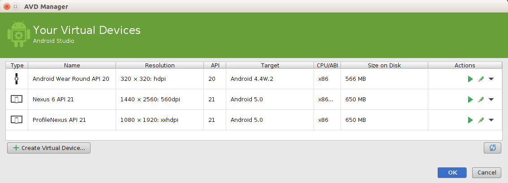

# 执行Android程序

If you followed the previous lesson to create an Android project, it includes a default set of "Hello World" source files that allow you to immediately run the app.(通过[上一节课](https://github.com/timosang/AndroidDemo/blob/master/Android%20Training/basics/firstapp/creating-project.md)创建了一个Android的Hello World项目，项目默认包含一系列源文件，它让我们可以立即运行应用程序。)

How you run your app depends on two things: whether you have a real device running Android and whether you're using Android Studio. This lesson shows you how to install and run your app on a real device and on the Android emulator, and in both cases with either Android Studio or the command line tools.（如何运行Android应用取决于两件事情：是否有一个Android设备和是否正在使用Android Studio开发程序。本节课将会教使用Android Studio和命令行两种方式在真实的android设备或者android模拟器上安装并且运行应用。）

##Run on a Real Device （在真实设备上运行）

If you have a device running Android, here's how to install and run your app.（如果有一个真实的Android设备，以下的步骤可以使我们在自己的设备上安装和运行应用程序：）

### Set up your device（手机设置）

1. Plug in your device to your development machine with a USB cable. If you're developing on Windows, you might need to install the appropriate（合适的，恰当的） USB driver for your device. For help installing drivers, see [OEM USB Drivers](http://developer.android.com/tools/extras/oem-usb.html) document.（把设备用USB线连接到计算机上。如果是在windows系统上进行开发的，你可能还需要安装你设备对应的USB驱动，详见[OEM USB Drivers](http://developer.android.com/tools/extras/oem-usb.html) 文档。）
2. Enable **USB debugging** on your device（开启设备上的**USB调试**选项。）
    *	On most devices running Android 3.2 or older, you can find the option under Settings > Applications > Development. （在大部分运行Andriod3.2或更老版本系统的设备上，这个选项位于“**设置**>**应用程序**>**开发选项**”里。）
    * On Android 4.0 and newer, it's in Settings > Developer options。（在Andriod 4.0或更新版本中，这个选项在“**设置**>**开发人员选项**”里。）

> **Note:** 	On Android 4.2 and newer, Developer options is hidden（隐藏） by default. To make it available, go to Settings > About phone and tap Build number seven times. Return to the previous screen to find Developer options.（从Android4.2开始，**开发人员选项**在默认情况下是隐藏的，想让它可见，可以去**设置>关于手机（或者关于设备)**点击**版本号**七次。再返回就能找到**开发人员选项**了。）

### Run the app from Android Studio（从Android Studio运行程序）

1. Select one of your project's files and click **Run**  from the toolbar.（选择项目的一个文件，点击工具栏里的**Run**按钮。）

2. In the **Choose Device** window that appears, select the **Choose a running device** radio button, select your device, and click **OK** .**Choose Device**窗口出现时，选择**Choose a running device**单选框，点击**OK**。

Android Studio installs the app on your connected device and starts it.
（Android Studio 会把应用程序安装到我们的设备中并启动应用程序。）

### 从命令行安装运行应用程序

Open a command-line and navigate to the root of your project directory. Use Gradle to build your project in debug mode, invoke the assembleDebug build task using the Gradle wrapper script (gradlew assembleRelease).

This creates your debug .apk file inside the module build/ directory, named MyFirstApp-debug.apk.

（打开命令行并切换当前目录到Andriod项目的根目录，在debug模式下使用Gradle编译项目，使用gradle脚本执行assembleDebug编译项目，执行后会在build/目录下生成MyFirstApp-debug.apk。）

On Windows platforms, type this command:
（Windows操作系统下，执行：）

```
gradlew.bat assembleDebug
```

On Mac OS and Linux platforms, type these commands:（
Mac OS或Linux系统下：）

```
$ chmod +x gradlew
$ ./gradlew assembleDebug
```
After you build the project, the output APK for the app module is located in app/build/outputs/apk/
（编译完成后在app/build/outputs/apk/目录生成apk）。

> **Note:** The first command (chmod) adds the execution permission to the Gradle wrapper script and is only necessary the first time you build this project from the command line.（chmod命令是给gradlew增加执行权限，只需要执行一次。）

Make sure the Android SDK platform-tools/ directory is included in your PATH environment variable, then execute:(
确保 Android SDK里的 `platform-tools/` 路径已经添加到环境变量`PATH`中，执行：)


```
adb install bin/MyFirstApp-debug.apk
```
On your device, locate MyFirstApp and open it.
(在我们的Android设备中找到 MyFirstActivity，点击打开。)

## 在模拟器上运行

Whether you're using Android Studio or the command line, to run your app on the emulator you need to first create an [Android Virtual Device](http://developer.android.com/tools/devices/index.html) (AVD). An AVD is a device configuration for the Android emulator that allows you to model a specific device.( 无论是使用 Android Studio 还是命令行，在模拟器中运行程序首先要创建一个 [Android Virtual Device](http://developer.android.com/tools/devices/index.html) (AVD)。AVD 是对 Android 模拟器的配置，可以让我们模拟不同的设备。)

###创建一个 AVD:
1\. 启动 Android Virtual Device Manager（AVD Manager）的两种方式：
    * 用Android Studio, **Tools > Android > AVD Manager**,或者点击工具栏里面Android Virtual Device Manager；
    * 在命令行窗口中，把当前目录切换到`<sdk>/tools/` 后执行：
```
android avd
```


2\. 在AVD Manager 面板中，点击**Create Virtual Device**.

3\. 在Select Hardware窗口，选择一个设备，比如 Nexus 6，点击**Next**。

4\. 选择列出的合适系统镜像.

5\. 校验模拟器配置，点击**Finish**。

更多AVD的知识请阅读[Managing AVDs with AVD Manager](http://developer.android.com/tools/devices/managing-avds.html).

### 从Android Studio运行程序：

1\. 在Android Studio选择要运行的项目，从工具栏选择**Run**；

2\. **Choose Device**窗口出现时，选择**Launch emulator**单选框；

3\. 从** Android virtual device**下拉菜单选择创建好的模拟器，点击**OK**；

模拟器启动需要几分钟的时间，启动完成后，解锁即可看到程序已经运行到模拟器屏幕上了。

### 从命令行安装运行应用程序

1\. 用命令行编译应用，生成位于app/build/outputs/apk/的apk；

2\. 确认platform-tools/ 已添加到PATH环境变量；

3\. 执行如下命令：

```
adb install app/build/outputs/MyFirstApp-debug.apk
```
4\. 在模拟器上找到MyFirstApp，并运行。

以上就是创建并在设备上运行一个应用的全部过程！想要开始开发，点击[next lesson](building-ui.html)。
