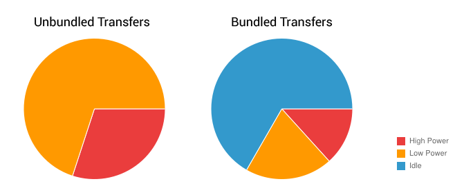

# Optimizing Downloads for Efficient Network Access

> 编写:[kesenhoo](https://github.com/kesenhoo) - 原文:<http://developer.android.com/training/efficient-downloads/efficient-network-access.html>

使用无线电波(wireless radio)进行传输数据这一行为也许是我们app最耗电的操作之一。为了最小化网络连接对电量消耗，懂得连接模式(connectivity model)会如何影响底层的无线电硬件设备是至关重要的。
这节课介绍了无线电波状态机(wireless radio state machine)，并解释了app的connectivity model是如何与状态机进行交互的。然后会提出建议的方法来最小化我们的数据连接，使用预取(prefetching)与捆绑(bundle)的方式进行数据的传输，这些操作都是为了最小化电量的消耗。

## 1)The Radio State Machine

一个完全活动的无线电会大量消耗电量，因此需要学习如何在不同状态下进行过渡，这样能够避免电量的浪费。
典型的3G无线电网络有三种能量状态：

* **Full power**: 当无线连接被激活的时候，允许设备以最大的传输速率进行操作。
* **Low power**: 一种中间状态，对电量的消耗差不多是Full power状态下的50%。
* **Standby**: 最低的状态，没有数据连接需要传输。

在最低并且空闲的状态下，电量消耗相对来说是少的。
这里需要介绍一延时(latency)的机制，从low status返回到full status大概需要花费1.5秒，从idle status返回到full status需要花费2秒。
为了最小化延迟，状态机使用了一种后滞过渡到更低能量状态的机制。下图是一个典型的3G无线电波状态机的图示(AT&T电信的一种制式).


* 在每一台设备上的无线状态机都会根据无线电波的制式(2G,3G,LTE等)而改变，并且由设备本身自己所使用的网络进行定义与配置。
* 这一课描述了一种典型的3G无线电波状态机，[data provided by AT&T](http://www.research.att.com/articles/featured_stories/2011_03/201102_Energy_efficient?fbid=SYuI20FzBum)。这些原理是具有通用性的，在其他的无线电波上同样适用。
* 这种方法在浏览通常的网页操作上是特别有效的，因为它可以阻止用户在浏览网页时的一些不必要的浪费。而且相对较短的后期处理时间也保证了当一个session结束的时候，无线电波可以转移到相对较低的能量状态。
* 不幸的是，这个方法会导致在现代的智能机系统例如Android上的apps效率低下。因为Android上的apps不仅仅可以在前台运行，也可以在后台运行。(无线电波的状态改变会影响到本来的设计，有些想在前台运行的可能会因为切换到低能量状态而影响程序效率。坊间说手机在电量低的状态下无线电波的强度会增大好几倍来保证信号，可能与这个有关。)

## 2)How Apps Impact the Radio State Machine

每一次新创建一个网络连接，无线电波就切换到full power状态。在上面典型的3G无线电波状态机情况下，无线电波会在传输数据时保持在full power的状态，结束之后会有一个附加的5秒时间切换到low power,再之后会经过12秒进入到low  energy的状态。因此对于典型的3G设备，每一次数据传输的会话都会引起无线电波都会持续消耗大概20秒的能量。

实际上，这意味着一个app传递1秒钟的unbundled data会使得无线电波持续活动18秒(18=1秒的传输数据+5秒过渡时间回到low power+12秒过渡时间回到standby)。因此每一分钟，它会消耗18秒high power的电量，42秒的low power的电量。

通过比较，如果每分钟app会传输bundle的data持续3秒的话，其中会使得无线电波持续在high power状态仅仅8秒钟，在low power状态仅仅12秒钟。
上面第二种传输bundle data的例子，可以看到减少了大量的电量消耗。图示如下：



## 3)Prefetch Data

预取(Prefetching)数据是一种减少独立数据传输会话数量的有效方法。预取技术指的是在一定时间内，单次连接操作，以最大能力下载的情况下，下载所有用户可能需要的数据。

通过前面的传输数据的技术，减少了大量下载数据所需的无线电波激活时间。这样不仅保存了电量，也降低了带宽，减少了下载时间。

预取技术通过减少了用户阅读所需等待的时间，提高了用户体验。

然而，过于频繁的预取技术的使用，不仅仅会导致电量消耗快速增长，还有可能预取到一些并不需要的数据。同样，确保app不会因为等待预取全部完成而卡到程序的开始播放也是非常重要的。从实践的角度，那意味着需要逐步处理数据，并且按照有优先级的顺序开始进行数据传递，这样能确保不卡到程序的开始播放的同时数据也能够得到持续的下载。

那么应该如何控制预取的操作呢？这需要根据正在下载的数据大小与可能被用到的数据量来决定。一个基于上面状态机情况的比较大概的建议是：对于数据来说，大概有50%的机会可能用在当前用户的会话中，那么我们可以预取大约6秒(大约1-2Mb)，这大概使得潜在可能要用的数据量与可能已经下载好的数据量相一致。

通常来说，预取1-5Mb会比较好，这种情况下，我们仅仅只需要每隔2-5分钟开始另一段下载。根据这个原理，大数据的下载，比如视频文件，应该每隔2-5分钟开始另一段下载，这样能有效的预取到下面几分钟内的数据进行预览。

值得注意的是，下载需要是bundled的形式，而且上面那些大概的数据与时间可能会根据网络连接的类型与速度有所变化，这些都将在下面两部分内容讲到。

让我们来看一些例子：

**A music player**
你可以选择预取整个专辑，然而这样用户在第一首歌曲之后停止监听，那么就浪费了大量的带宽于电量。
一个比较好的方法是维护一首歌曲的缓冲区。对于流媒体音乐，不应该去维护一段连续的数据流，因为这样会使得无线电波一直保持激活状态，应该考虑把HTTP的数据流集中一次传输到音频流，就像上面描述的预取技术一样(下载好2Mb，然后开始一次取出，再去下载下面的2Mb)。

**A news reader**
许多news apps尝试通过只下载新闻标题来减少带宽，完整的文章仅在用户想要读取的时候再去读取，而且文章也会因为太长而刚开始只显示部分信息，等用户下滑时再去读取完整信息。
使用这个方法，无线电波仅仅会在用户点击更多信息的时候才会被激活。但是，在切换文章分类预阅读文章的时候仍然会造成大量潜在的消耗。

一个比较好的方法是在启动的时候预取一个合理数量的数据，比如在启动的时候预取一些文章的标题与缩略图信息。之后开始获取剩余的标题预缩略信息。

另一个方法是预取所有的标题，缩略信息，文章文字，甚至是所有文章的图片-根据既设的后台程序进行逐一获取。这样做的风险是花费了大量的带宽与电量去下载一些不会阅读到的内容，因此这需要比较小心思考是否合适。其中的一个解决方案是，当在连接至Wi-Fi时有计划的下载所有的内容，并且如果有可能最好是设备正在充电的时候。关于这个的细节的实现，我们将在后面的课程中涉及到。

## 4)Batch Transfers and Connections

使用典型3G无线网络制式的时候，每一次初始化一个连接(与需要传输的数据量无关)，都有可能导致无线电波持续花费大约20秒的电量。

一个app，若是每20秒进行一次ping server的操作，假设这个app是正在运行且对用户可见，那么这会导致无线电波不确定什么时候被开启，这样即使在没有实际数据需要传输的情况下，仍可能造成大量电量的花费。

因此，对数据进行bundle操作并且创建一个序列来存放这些bundle好的数据就显的非常重要。操作正确的话，可以使得大量的数据集中进行发送，这样使得无线电波的激活时间尽可能的少，同时减少大部分电量的花费。这样做的潜在好处是尽可能在每次传输数据的会话中尽可能多的传输数据而且减少了会话的次数。

## 5)Reduce Connections

重用已经存在的网络连接比起重新建立一个新的连接通常来说是更有效率的。重用网络连接同样可以使得在拥挤不堪的网络环境中进行更加智能的互动。当可以捆绑所有请求在一个GET里面的时候不要同时创建多个网络连接或者把多个GET请求进行串联。

例如，可以一起请求所有文章的情况下，不要根据多个栏目进行多次请求。为进行termination / termination acknowledgement packets的收发，无线电波会在timeout之前保持激活状，所以如果不需要的连接请立即关闭而不是等待他们timeout。

之前说道，如果过早对一个连接执行关闭操作，会导致后面再次请求时重新建立一个在Server与Client之间的连接，而我们说过要尽量避免建立重复的连接，那么有个有效的折中办法是不要立即关闭，而是在timeout之前关闭(即稍微晚点却又不至于到timeout)。

> **Note**:使用HttpUrlConnection，而不是Apache的HttpClient，前者有做response cache.

## 6)Use the DDMS Network Traffic Tool to Identify Areas of Concern

The Android [DDMS (Dalvik Debug Monitor Server)](http://developer.android.com/guide/developing/debugging/ddms.html) 包含了一个查看网络使用详情的栏目来允许跟踪app的网络请求。使用这个工具，可以监测app是在何时，如何传输数据的，从而进行代码的优化。

下图显示了传输少量的网络模型，可以看到每次差不多相隔15秒，这意味着可以通过预取技术或者批量上传来大幅提高效率。


通过监测数据传输的频率与每次传输的数据量，可以查看出哪些位置应该进行优化，通常的，图中显示的短小的类似钉子形状的位置，可以进行与附近位置的请求进行做merge的动作。

为了更好的检测出问题所在，**Traffic Status API**允许你使用**TrafficStats.setThreadStatsTag()**的方法标记数据传输发生在某个Thread里面，然后可以手动的使用tagSocket()进行标记到或者使用untagSocket()来取消标记，例如：

```java
TrafficStats.setThreadStatsTag(0xF00D);
TrafficStats.tagSocket(outputSocket);
// Transfer data using socket
TrafficStats.untagSocket(outputSocket);
```

Apache的HttpClient与URLConnection库可以自动tag sockets使用当前getThreadStatusTag()的值。那些库在通过keep-alive pools循环的时候也会tag与untag sockets。

```java
TrafficStats.setThreadStatsTag(0xF00D);
try {
  // Make network request using HttpClient.execute()
} finally {
  TrafficStats.clearThreadStatsTag();
}
```

Socket tagging 是在Android 4.0上才被支持的, 但是实际情况是仅仅会在运行Android 4.0.3 or higher的设备上才会显示.
