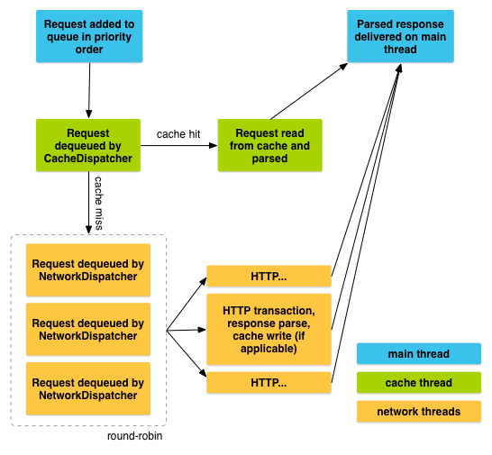

# 发送简单的网络请求(Sending a Simple Request)

> 编写:[kesenhoo](https://github.com/kesenhoo) - 原文:<http://developer.android.com/training/volley/simple.html>

使用Volley的方式是，你通过创建一个`RequestQueue`并传递`Request`对象给它。RequestQueue管理用来执行网络操作的工作线程，从Cache中读写数据，并解析Http的响应内容。`Requests`执行raw responses的解析，Volley会把响应的数据分发给主线程。

这节课会介绍如何使用`Volley.newRequestQueue`这个建立请求队列RequestQueue的方法来发送一个请求，在下一节课[建立一个请求队列Setting Up a RequestQueue](request-queue.html)中会介绍你自己如何建立一个请求队列。

这节课也会介绍如何添加一个请求到RequesutQueue以及如何取消一个请求。

## 1)Add the INTERNET Permission

为了使用Volley，你必须添加`android.permission.INTERNET `权限到你的manifest文件中。没有这个权限，你的app将无法访问网络。

## 2)Use newRequestQueue

Volley提供了一个简便的方法：`Volley.newRequestQueue`用来为你建立一个`RequestQueue`，使用默认值，并启动这个队列。例如：

```java
final TextView mTextView = (TextView) findViewById(R.id.text);
...

// Instantiate the RequestQueue.
RequestQueue queue = Volley.newRequestQueue(this);
String url ="http://www.google.com";

// Request a string response from the provided URL.
StringRequest stringRequest = new StringRequest(Request.Method.GET, url,
            new Response.Listener() {
    @Override
    public void onResponse(String response) {
        // Display the first 500 characters of the response string.
        mTextView.setText("Response is: "+ response.substring(0,500));
    }
}, new Response.ErrorListener() {
    @Override
    public void onErrorResponse(VolleyError error) {
        mTextView.setText("That didn't work!");
    }
});
// Add the request to the RequestQueue.
queue.add(stringRequest);
```

Volley总是将解析后的数据返回至主线程中。在主线程中更加合适使用接收到的数据用来操作UI控件，这样你可以在响应的handler中轻松的修改UI，但是对于库提供的一些其他方法是有些特殊的，例如与取消有关的。

关于如何创建你自己的请求队列，而不是使用Volley.newRequestQueue方法，请查看[建立一个请求队列Setting Up a RequestQueue](request-queue.html)。

## 3)Send a Request

为了发送一个请求，你只需要构造一个请求并通过`add()`方法添加到`RequestQueue`中。一旦你添加了这个请求，它会通过队列，得到处理，然后得到原始的响应数据并返回。

当你执行`add()`方法时，Volley触发执行一个缓存处理线程以及一系列网络处理线程。当你添加一个请求到队列中，它将被缓存线程所捕获并触发：如果这个请求可以被缓存处理，那么会在缓存线程中执行响应数据的解析并返回到主线程。如果请求不能被缓存所处理，它会被放到网络队列中。网络线程池中的第一个可用的网络线程会从队列中获取到这个请求并执行HTTP操作，解析工作线程的响应数据，把数据写到缓存中并把解析之后的数据返回到主线程。

请注意那些比较耗时的操作，例如I/O与解析parsing/decoding都是执行在工作线程。**你可以在任何线程中添加一个请求，但是响应结果都是返回到主线程的。**

下图1，演示了一个请求的生命周期：



## 4)Cancel a Request

对请求Request对象调用`cancel()`方法取消一个请求。一旦取消，Volley会确保你的响应Handler不会被执行。这意味着在实际操作中你可以在activity的`onStop()`方法中取消所有pending在队列中的请求。你不需要通过检测`getActivity() == null`来丢弃你的响应handler，其他类似`onSaveInstanceState()`等保护性的方法里面也都不需要检测。

为了利用这种优势，你应该跟踪所有已经发送的请求，以便在需要的时候可以取消他们。**有一个简便的方法**：你可以为每一个请求对象都绑定一个tag对象。然后你可以使用这个tag来提供取消的范围。例如，你可以为你的所有请求都绑定到执行的Activity上，然后你可以在`onStop()`方法执行`requestQueue.cancelAll(this)` 。同样的，你可以为ViewPager中的所有请求缩略图Request对象分别打上对应Tab的tag。并在滑动时取消这些请求，用来确保新生成的tab不会被前面tab的请求任务所卡到。

下面一个使用String来打Tag的例子：

1. 定义你的tag并添加到你的请求任务中。

```java
public static final String TAG = "MyTag";
StringRequest stringRequest; // Assume this exists.
RequestQueue mRequestQueue;  // Assume this exists.

// Set the tag on the request.
stringRequest.setTag(TAG);

// Add the request to the RequestQueue.
mRequestQueue.add(stringRequest);
```

2. 在activity的onStop()方法里面，取消所有的包含这个tag的请求任务。

```java
@Override
protected void onStop () {
    super.onStop();
    if (mRequestQueue != null) {
        mRequestQueue.cancelAll(TAG);
    }
}
```

当取消请求时请注意：如果你依赖你的响应handler来标记状态或者触发另外一个进程，你需要对此进行考虑。再说一次，response handler是不会被执行的。


