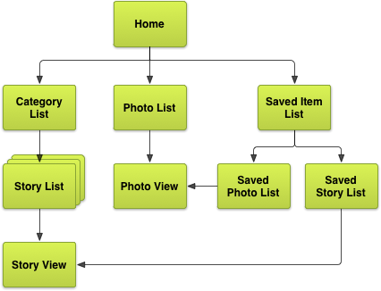

# Planning Screens and Their Relationships（规划界面和他们之间的关系）

Most apps have an inherent（固有的，内在的） information model that can be expressed（表达） as a tree or graph of object types. In more obvious （明显的，显著的） terms, you can draw a diagram（图表） of different kinds of information that represents the types of things users interact with in your app. Software engineers and data architects often use **entity-relationship diagrams** (ERDs) to describe an application's information model.（多数 App 都有一种内在的信息模型，它能被表示成一个用对象类型构成的树或图。更浅显的说，你可以画一个有不同类型信息的图，这些信息代表用户在你 App 里用户与之互动的各种东西。软件工程师和数据架构师经常使用实例-关系图（Entity-Relationship Diagram，ERD）描述一个应用的信息模型。）

Let's consider an example application that allows users to browse （浏览） through a set of categorized news stories （新闻事件）and photos. One possible model for such an app is shown below in the form of an ERD.（让我们考虑一个让用户浏览一群已分类好的新闻事件和图片的应用例子。这种 App 一个可能的模型如下 ERD 图。）

**Figure 1.**  Entity-relationship diagram for the example news application（新闻应用例子的实例关系图）

## Create a Screen List（创建一个界面列表）

Once you define the information model, you can begin to define the contexts（上下文环境） necessary to enable users to effectively discover, view, and act upon（对。。起作用） the data in your application. In practice, one way to do this is to determine the exhaustive set of screens needed to allow users to navigate to and interact with the data. The set of screens we actually expose should generally vary depending on the target device; it's important to consider this early in the design process to ensure that the application can adapt to its environment.（一旦你定义了信息模型，你就可以开始定义那些能使用户在你的 App  中有效地发掘，查看和操作数据的上下文环境了。实际上，其中一种方法就是确定供用户导航和交互数据所需的 *界面完备集*（归纳了所有界面的集合）。但我们实际发现的界面集合应该根据目标设备变化。在设计过程中早点考虑到这点很重要，这样可以保证程序可以适应运行环境。）

In our example application, we want to enable users to **view**, **save**, and **share** categorized **stories** and **photos**. Below is an exhaustive list of screens that covers these use cases.（
在我们的例子中，我们想让用户**查看**，**保存**和**分享**分类好了的**新闻**和**图片**。下面是涵盖了这些用例的界面完备列表。）

* Home or "launchpad" screen for accessing stories and photos( 用来访问新闻和图片的 Home 或者 "Launchpad" 画面)
* List of categories(类别列表)
* List of news stories for a given category(某个分类下的新闻列表)
* 新闻详情 View （在这里我们可以保存和分享）
* 图片列表，不分类
* 图片详情 View （在这里我们可以保存和分享）
* 所有保存项列表
* 图片保存列表
* 新闻保存列表

## 图示界面关系

现在我们可以定义界面间的有向关系了。一个从界面 *A* 指向另一个界面 *B* 的箭头表示通过用户在画面 *A* 的某个交互动作可直达画面 *B* 。一旦我们定义了界面集和他们之间的关系，我们可以将他们一起全部表示在一张界面图中了：

**Figure 2.** 新闻应用例子的界面完备Map

如果之后我们想允许用户提交新闻事件或者上传图片，我们可以在图中加额外的界面。

## 脱离简陋设计

这时，我们可以据这张完备的界面图设计一个功能完备应用了。可以由列表和导向子界面的按钮构成一个简单的UI：

* 导向不同页面的按钮（例如，新闻，图片，保存的项目）
* 纵向列表表示集合（例如，新闻列表，图片列表，等等）
* 详细信息（例如，新闻 View ，图片 View ，等等）

但是，你可以利用屏幕组合技术和更高深导航元素以一种更直观，设备更理解的方式呈现内容。下节课，我们探索屏幕组合技术，比如为平板而生的多视窗（Multi-pane）布局。之后，我将深入讲解更多不同的 Android 常见导航模式。

[下节课：规划多种触屏大小](multi-sizes.html)
