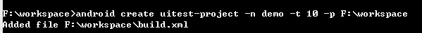
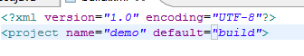
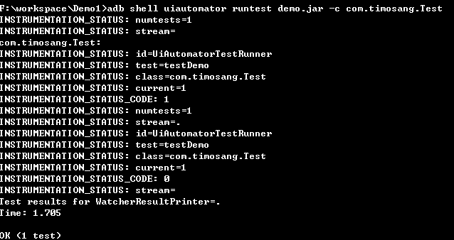

#Android UI自动化测试
##Android当前各种UI测试框架

### MonkeyRunner 

1. 编写语言：Python
2. 运行环境：Python环境，adb连接pc运行
3. 测试对象：UI测试
4. 测试限制：主要使用坐标，逻辑判断较差

###Instrumentation

1. 编写语言：java
2. 运行环境：adb启动或者手机中直接测试
3. 测试限制：单个Activity测试，需与测试应用相同的签名
4. 测试对象：主要用于白盒测试和UI测试

###Robotium

1.编写语言： java ，基于Instrumention封装
2.运行环境和测试限制与Instrumention一样。

###UIAutomator

谷歌在Android 4.1推出UiAutomator测试框架

作用：

1. 主要用于UI自动化测试
2. 功能：模拟人对手机的操作，模拟各种动作如点击、长按、滑动、按键等操作
3. 优点：编写简单、运行简单、API简单易学、无Activity限制、没有签名限制、几乎可以模拟所有的认为操作。
4. 缺点：对权限控制不足、无法像Instrumentation一样高权限的操作应用、很多Android API无法使用

Android4.1以上的手机都可以用UIAutomaotor框架测试

##配置编写环境

1. JDK1.6以上、ADT
2. 配置Java开发环境
	
	1. 安装JDK
	2. 配置环境变量
	3. 验证开发环境是否配置成功

3. Android环境配置
	
	1. 增加ANDROID_HOME环境变量（指定是SDK的路径）
	2. 配置PATH路径（添加tools、platform-tools路径下的adb、uiautomatorviewer、ddms）
	3. 验证环境是否配置成功

4. ANT环境配置
	
	1. 增加ANT_HOME环境变量
	2. 配置PATH路径
	3. 验证环境是否配置成功

##新建测试工程

新建测试工程步骤：

1. 打开IDE
2. 新建一个Java工程、包 
3. 增加build path(android.jar 、uiautomaotor.jar)
4. 新建测试类，继承UiAutomatorTestCase
5. 编写测试用例，方法名必须以test开头
6. 编译与运行  

##编译运行代码

1. 创建build文件

	`android create uitest-project -n <jars> -t 1 -p <workspace path>`
	
	
2. 修改build文件
	
			进行工作空间，打开build.xml文件, 将第二行的help修改为build
	
3. 开始编译
    
		ant -bulidfile <build.xml 文件路径>
	
4. push文件
	
		adb push <path_to_output_jar > /data/local/tmp/
 	
5. 运行测试
	
		adb shell uiautomator runtest <jars> -c <包名>.类名[#test name]
	

##运行命令与快速调试

adb shell uiautomator runtest <jars> -c <CLASSES> [options]

子命令 runtest

操作参数

1. <JARS> 指定运行jar包文件名，位于路径/data/local/tmp/下
2. `-c <CLASSES>`
	
	* 测试一个类下的所有用例格式:`package_name.class_name`
	* 测试特定的某个方法：package_name.class_name#method_name
	* 可以指定多个-c （按一定顺序执行用例）
	* 如果不指定,则运行整个jar包下的所有用例
3. --nphup
   指定此参数，可断开pc进行运行测试用例
4. `-e <name> <value>` 传入一个键值对到测试程序中，可用于一些需要变化的参数的传入。  

