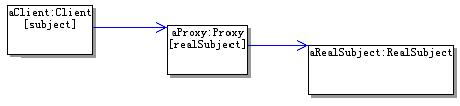

#代理设计模式

定义：为其它对象提供一种代理以控制对这个对象的访问。

结构：


* Proxy：代理对象，通常具有如下功能：

	1. 实现与具体的目标对象一样的接口，这样就可以使用代理来代替具体的目标对象
	2. 保存一个指向具体目标对象的引用，可以在需要的时候调用具体的目标对象
	3. 可以控制对具体目标对象的访问，并可能负责创建和删除它
* Subject：目标接口
	
	定义代理和具体目标对象的接口，这样就可以在任何使用具体目标对象的地方使用代理对象
* RealSubject：具体的目标对象
	
	真正实现目标接口要求的功能。


在运行时刻一种可能的代理结构的对象图


一个标准的代理设计模式的实现：

目标接口：

```java
/**
 * 抽象的目标接口，定义具体的目标对象和代理公用的接口
 */
public interface Subject {
	/**
	 * 示意方法：一个抽象的请求方法
	 */
	public void request();
}


```


具体的目标对象:

```java

/**
 * 具体的目标对象，是真正被代理的对象
 */
public class RealSubject implements Subject{

	public void request() {
		//执行具体的功能处理
	}

}

```

代理对象：

```java
/**
 * 代理对象
 */
public class Proxy implements Subject{
	/**
	 * 持有被代理的具体的目标对象
	 */
	private RealSubject realSubject=null;
	/**
	 * 构造方法，传入被代理的具体的目标对象
	 * @param realSubject 被代理的具体的目标对象
	 */
	public Proxy(RealSubject realSubject){
		this.realSubject = realSubject;
	}
	
	public void request() {
		//在转调具体的目标对象前，可以执行一些功能处理
		
		//转调具体的目标对象的方法
		realSubject.request();
		
		//在转调具体的目标对象后，可以执行一些功能处理
	}

}

```

某一时刻，代理结构的对象图如下午所示：




假如我们需要修改subject.java，向其中添加几个功能。但是直接在subject.java中的request方法修改添加，会破坏面向对象设计原则中的开闭原则，我们可以通过代理设计模式来实现。从某种意义上来说，我们可以在原来的功能上添加一些功能。类似于装饰设计模式

```java
/**
 * 代理对象
 */
public class Proxy implements Subject{
	/**
	 * 持有被代理的具体的目标对象
	 */
	private RealSubject realSubject=null;
	/**
	 * 构造方法，传入被代理的具体的目标对象
	 * @param realSubject 被代理的具体的目标对象
	 */
	public Proxy(RealSubject realSubject){
		this.realSubject = realSubject;
	}
	
	public void request() {
		//在转调具体的目标对象前，可以执行一些功能处理
		//要添加的功能1
		//转调具体的目标对象的方法
		realSubject.request();
		//要添加的功能2
		//在转调具体的目标对象后，可以执行一些功能处理
	}

}


```


##实际应用

访问多条数据：要一次性的访问多条数据

功能的背景是这样的；在一个HR（人力资源）应用项目中客户提出，当选择一个部门或是分公司的时候，要把这个部门或者分公司下的所有员工都显示出来，而且不要翻页，好方便他们进行业务处理。在显示全部员工的时候，只需要显示名称即可，但是也需要提供如下的功能：在必要的时候可以选择并查看某位员工的详细信息。
       
客户方是一个集团公司，有些部门或者分公司可能有好几百人，不让翻页，也就是要求一次性的获取这多条数据并展示出来。


###不用模式的解决方案

我们可以直接使用sql语句从数据库中查询可以得到。

```sql

String sql = "select * from 用户表,部门表 "
       +"where 用户表.depId=部门表.depId "
       +"and 部门表.depId like '"+用户选择查看的depId+"%'";

```

为了方便获取某个部门或者某个分公司下的所有员工的信息，设计部门编号的时候，是按照层级来进行编码的，比如：上一级部门的编码为“01”，那么本级的编码就是“0101”、“0102”……以此类推，下一级的编码就是“010101”、“010102”……。
       

这种设计方式，从设计上看虽然不够优雅，但是实用，像这种获取某个部门或者某个分公司下的所有员工的信息的功能，就不用递归去查找了，直接使用like，只要找到以该编号开头的所有部门就可以了。