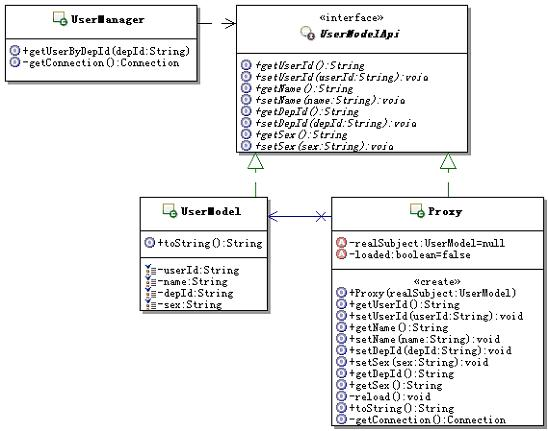

#代理设计模式

定义：为其它对象提供一种代理以控制对这个对象的访问。

结构：


* Proxy：代理对象，通常具有如下功能：

	1. 实现与具体的目标对象一样的接口，这样就可以使用代理来代替具体的目标对象
	2. 保存一个指向具体目标对象的引用，可以在需要的时候调用具体的目标对象
	3. 可以控制对具体目标对象的访问，并可能负责创建和删除它
* Subject：目标接口
	
	定义代理和具体目标对象的接口，这样就可以在任何使用具体目标对象的地方使用代理对象
* RealSubject：具体的目标对象
	
	真正实现目标接口要求的功能。


在运行时刻一种可能的代理结构的对象图


一个标准的代理设计模式的实现：

目标接口：

```java
/**
 * 抽象的目标接口，定义具体的目标对象和代理公用的接口
 */
public interface Subject {
	/**
	 * 示意方法：一个抽象的请求方法
	 */
	public void request();
}


```


具体的目标对象:

```java

/**
 * 具体的目标对象，是真正被代理的对象
 */
public class RealSubject implements Subject{

	public void request() {
		//执行具体的功能处理
	}

}

```

代理对象：

```java
/**
 * 代理对象
 */
public class Proxy implements Subject{
	/**
	 * 持有被代理的具体的目标对象
	 */
	private RealSubject realSubject=null;
	/**
	 * 构造方法，传入被代理的具体的目标对象
	 * @param realSubject 被代理的具体的目标对象
	 */
	public Proxy(RealSubject realSubject){
		this.realSubject = realSubject;
	}
	
	public void request() {
		//在转调具体的目标对象前，可以执行一些功能处理
		
		//转调具体的目标对象的方法
		realSubject.request();
		
		//在转调具体的目标对象后，可以执行一些功能处理
	}

}

```

某一时刻，代理结构的对象图如下午所示：


假如我们需要修改subject.java，向其中添加几个功能。但是直接在subject.java中的request方法修改添加，会破坏面向对象设计原则中的开闭原则，我们可以通过代理设计模式来实现。从某种意义上来说，我们可以在原来的功能上添加一些功能。类似于装饰设计模式

```java
/**
 * 代理对象
 */
public class Proxy implements Subject{
	/**
	 * 持有被代理的具体的目标对象
	 */
	private RealSubject realSubject=null;
	/**
	 * 构造方法，传入被代理的具体的目标对象
	 * @param realSubject 被代理的具体的目标对象
	 */
	public Proxy(RealSubject realSubject){
		this.realSubject = realSubject;
	}
	
	public void request() {
		//在转调具体的目标对象前，可以执行一些功能处理
		//要添加的功能1
		//转调具体的目标对象的方法
		realSubject.request();
		//要添加的功能2
		//在转调具体的目标对象后，可以执行一些功能处理
	}

}


```


##实际应用

访问多条数据：要一次性的访问多条数据

功能的背景是这样的；在一个HR（人力资源）应用项目中客户提出，当选择一个部门或是分公司的时候，要把这个部门或者分公司下的所有员工都显示出来，而且不要翻页，好方便他们进行业务处理。在显示全部员工的时候，只需要显示名称即可，但是也需要提供如下的功能：在必要的时候可以选择并查看某位员工的详细信息。
       
客户方是一个集团公司，有些部门或者分公司可能有好几百人，不让翻页，也就是要求一次性的获取这多条数据并展示出来。


###不用模式的解决方案

我们可以直接使用sql语句从数据库中查询可以得到。

```sql

String sql = "select * from 用户表,部门表 "
       +"where 用户表.depId=部门表.depId "
       +"and 部门表.depId like '"+用户选择查看的depId+"%'";

```

为了方便获取某个部门或者某个分公司下的所有员工的信息，设计部门编号的时候，是按照层级来进行编码的，比如：上一级部门的编码为“01”，那么本级的编码就是“0101”、“0102”……以此类推，下一级的编码就是“010101”、“010102”……。
       

这种设计方式，从设计上看虽然不够优雅，但是实用，像这种获取某个部门或者某个分公司下的所有员工的信息的功能，就不用递归去查找了，直接使用like，只要找到以该编号开头的所有部门就可以了。


有什么问题
上面的实现看起来很简单，功能也正确，但是蕴含一个较大的问题，那就是：当一次性访问的数据条数过多，而且每条描述的数据量又很大的话，那会消耗较多的内存。
前面也说了，对于用户表，事实上是有很多字段的，不仅仅是示例的那么几个，再加上不使用翻页，一次性访问的数据就可能会有很多条。如果一次性需要访问的数据较多的话，内存开销会比较大。
但是从客户使用角度来说，有很大的随机性，客户既可能访问每一条数据，也可能一条都不访问。也就是说，一次性访问很多条数据，消耗了大量内存，但是很可能是浪费掉了，客户根本就不会去访问那么多数据，对于每条数据，客户只需要看看姓名而已。

###使用模式的解决方案



定义用户数据对象的接口

```java

/**
 * 定义用户数据对象的接口
 */
public interface UserModelApi {
	public String getUserId();
	public void setUserId(String userId);
	public String getName();
	public void setName(String name);
	public String getDepId();
	public void setDepId(String depId);
	public String getSex();
	public void setSex(String sex);
}


```

描述用户数据的对象
```java
/**
 * 描述用户数据的对象
 */
public class UserModel implements UserModelApi{	
	/**
	 * 用户编号
	 */
	private String userId;
	/**
	 * 用户姓名
	 */
	private String name;
	/**
	 * 部门编号
	 */
	private String depId;
	/**
	 * 性别
	 */
	private String sex;
	
	public String getUserId() {
		return userId;
	}
	public void setUserId(String userId) {
		this.userId = userId;
	}
	public String getName() {
		return name;
	}
	public void setName(String name) {
		this.name = name;
	}
	public String getDepId() {
		return depId;
	}
	public void setDepId(String depId) {
		this.depId = depId;
	}
	public String getSex() {
		return sex;
	}
	public void setSex(String sex) {
		this.sex = sex;
	}
	
	@Override
	public String toString(){
		return "userId="+userId+",name="+name+",depId="+depId+",sex="+sex+"\n";
	}
}


```

```java
import java.util.*;
import java.sql.*;

/**
 * 实现示例要求的功能
 */
public class UserManager {	
	/**
	 * 根据部门编号来获取该部门下的所有人员
	 * @param depId 部门编号
	 * @return 该部门下的所有人员
	 */
	public Collection<UserModelApi> getUserByDepId(String depId)throws Exception{
		Collection<UserModelApi> col = new ArrayList<UserModelApi>();
		Connection conn = null;
		try{
			conn = this.getConnection();
			//只需要查询userId和name两个值就可以了
			String sql = "select u.userId,u.name "
				+"from tbl_user u,tbl_dep d "
				+"where u.depId=d.depId and d.depId like ?";

			PreparedStatement pstmt = conn.prepareStatement(sql);
			pstmt.setString(1, depId+"%");
			
			ResultSet rs = pstmt.executeQuery();
			while(rs.next()){
				//这里是创建的代理对象，而不是直接创建UserModel的对象
				Proxy proxy = new Proxy(new UserModel());
				//只是设置userId和name两个值就可以了
				proxy.setUserId(rs.getString("userId"));
				proxy.setName(rs.getString("name"));
				
				col.add(proxy);
			}
			
			rs.close();
			pstmt.close();
		}finally{
			conn.close();
		}
		return col;
	}
	/**
	 * 获取与数据库的连接
	 * @return 数据库连接
	 */
	private Connection getConnection() throws Exception {
		Class.forName("oracle.jdbc.driver.OracleDriver");
		return DriverManager.getConnection(
				"jdbc:oracle:thin:@localhost:1521:orcl", "test", "test");
	}
}


```

代理对象，代理用户数据对象
```java
import java.sql.*;
import java.util.*;

/**
 * 代理对象,代理用户数据对象
 */
public class Proxy implements UserModelApi{
	/**
	 * 持有被代理的具体的目标对象
	 */
	private UserModel realSubject=null;
	/**
	 * 构造方法，传入被代理的具体的目标对象
	 * @param realSubject 被代理的具体的目标对象
	 */
	public Proxy(UserModel realSubject){
		this.realSubject = realSubject;
	}
	/**
	 * 标示是否已经重新装载过数据了
	 */
	private boolean loaded = false;
	
	
	public String getUserId() {
		return realSubject.getUserId();
	}
	public void setUserId(String userId) {
		realSubject.setUserId(userId);
	}
	public String getName() {
		return realSubject.getName();
	}
	public void setName(String name) {
		realSubject.setName(name);
	}
	
	
	public void setDepId(String depId) {
		realSubject.setDepId(depId);
	}
	public void setSex(String sex) {
		realSubject.setSex(sex);
	}
	
	public String getDepId() {
		//需要判断是否已经装载过了
		if(!this.loaded){
			//从数据库中重新装载
			reload();
			//设置重新装载的标志为true
			this.loaded = true;
		}
		return realSubject.getDepId();
	}	
	public String getSex() {
		if(!this.loaded){
			reload();
			this.loaded = true;
		}
		return realSubject.getSex();
	}
	
	/**
	 * 重新查询数据库以获取完整的用户数据
	 */
	private void reload(){
		System.out.println("重新查询数据库获取完整的用户数据，userId=="+realSubject.getUserId());
		Connection conn = null;
		try{
			conn = this.getConnection();
			String sql = "select * from tbl_user where userId=? ";

			PreparedStatement pstmt = conn.prepareStatement(sql);
			pstmt.setString(1, realSubject.getUserId());
			
			ResultSet rs = pstmt.executeQuery();
			if(rs.next()){
				//只需要重新获取除了userId和name外的数据
				realSubject.setDepId(rs.getString("depId"));
				realSubject.setSex(rs.getString("sex"));
			}
			
			rs.close();
			pstmt.close();
		}catch(Exception err){
			err.printStackTrace();
		}finally{
			try {
				conn.close();
			} catch (SQLException e) {
				e.printStackTrace();
			}
		}
	}
	public String toString(){
		return "userId="+getUserId()+",name="+getName()
		+",depId="+getDepId()+",sex="+getSex()+"\n";
	}

	private Connection getConnection() throws Exception {
		Class.forName("oracle.jdbc.driver.OracleDriver");
		return DriverManager.getConnection(
				"jdbc:oracle:thin:@localhost:1521:orcl", "test", "test");
	}
}


```

分析：这个需求的要求是需要一次性访问多条数据（即全部员工的姓名），基本上上只需要访问员工的姓名，因此可以考虑刚开始从数据库查询返回的数据就只有用户编号和用户姓名。当客户想要查看某个用户的数据的时候，再次根据用户编号到数据库中获取完整数据。这样，在满足客户端功能的前提下，大大减少了对内存的消耗，只是每次需要重新查询一下数据，算是一个以**时间换空间的策略**。

代理模式引入一个Proxy对象来解决这个问题，刚开始只有用户编号和姓名的时候，不是一个完整的用户对象，而是一个代理对象，当需要访问完整的用户数据的时候，代理会从数据库中重新获取相应的数据，通常情况下是当客户需要访问除了用户编号和姓名之外的数据的时候，代理才会重新去获取数据。


运行结果


	用户编号：=user0001,用户姓名：=张三1
	用户编号：=user0002,用户姓名：=张三2
	用户编号：=user0003,用户姓名：=张三3
	重新查询数据库获取完整的用户数据，userId==user0001
	用户编号：=user0001,用户姓名：=张三1,所属部门：=010101
	重新查询数据库获取完整的用户数据，userId==user0002
	用户编号：=user0002,用户姓名：=张三2,所属部门：=010101
	重新查询数据库获取完整的用户数据，userId==user0003
	用户编号：=user0003,用户姓名：=张三3,所属部门：=010102

前三条一次性加载，后三条当需要访问某个用户数据时，重新加载完整的用户数据。也就是说如果只是访问用户编号和用户姓名的数据，是不需要重新查询数据库的，只有当访问到这两个数据以外的数据时，才需要重新查询数据库以获得完整的数据。这样一来，如果客户不访问除这两个数据以外的数据，那么就不需要重新查询数据库，也就不需要装载那么多数据，从而节省内存。


1+N次查询
      
看完上面的示例，可能有些朋友会发现，这种实现方式有一个潜在的问题，就是如果客户对每条用户数据都要求查看详细的数据的话，那么总的查询数据库的次数会是1+N次之多。
      
第一次查询，获取到N条数据的用户编号和姓名，然后展示给客户看。如果这个时候，客户对每条数据都点击查看详细信息的话，那么每一条数据都需要重新查询数据库，那么最后总的查询数据库的次数就是1+N次了。
       
从上面的分析可以看出，这种做法最合适的场景就是：**客户大多数情况下只需要查看用户编号和姓名，而少量的数据需要查看详细数据。这样既节省了内存，又减少了操作数据库的次数。**
       
看到这里，可能会有朋友想起，Hibernate这类ORM的框架，在Lazy Load的情况下，也存在1+N次查询的情况，原因就在于，Hibernate的Lazy Load就是使用代理来实现的，具体的实现细节这里就不去讨论了，但是原理是一样的。

##深入理解代理模式

###代理模式的模式

代理模式是通过创建一个代理对象，用这个代理对象去代表真实的对象，客户端得到这个代理对象过后，对客户端没有什么影响，就跟得到了真实对象一样来使用。
       
当客户端操作这个代理对象的时候，实际上功能最终还是会由真实的对象来完成，只不过是通过代理操作的，也就是客户端操作代理，代理操作真正的对象。
       
正是因为有代理对象夹在客户端和被代理的真实对象中间，相当于一个中转，那么在中转的时候就有很多花招可以玩，比如：判断一下权限，如果没有足够的权限那就不给你中转了，等等。

###代理模式的分类


* 虚代理：根据需要来创建开销很大的对象，该对象只有在需要的时候才会被真正创建（上面这个例子就是虚代理）
* 远程代理：用来在不同的地址空间上代表同一个对象，这个不同的地址空间可以是在本机，也可以在其它机器上，在Java里面最典型的就是RMI技术
* copy-on-write代理：在客户端操作的时候，只有对象确实改变了，才会真的拷贝（或克隆）一个目标对象，算是虚代理的一个分支
* 保护代理：控制对原始对象的访问，如果有需要，可以给不同的用户提供不同的访问权限，以控制他们对原始对象的访问
* Cache代理：为那些昂贵的操作的结果提供临时的存储空间，以便多个客户端可以共享这些结果
* 防火墙代理：保护对象不被恶意用户访问和操作
* 同步代理：使多个用户能够同时访问目标对象而没有冲突
* 智能指引：在访问对象时执行一些附加操作，比如：对指向实际对象的引用计数、第一次引用一个持久对象时，将它装入内存等


###虚代理示例

虚代理的示例：前面的例子就是一个典型的虚代理的实现。
起初每个代理对象只有用户编号和姓名的数据，直到需要的时候，才会把整个用户的数据装载到内存中来。
也就是说，要根据需要来装载整个UserModel的数据，虽然用户数据对象是前面已经创建好了的，但是只有用户编号和姓名的数据，可以看成是一个“虚”的对象，直到通过代理把所有的数据都设置好，才算是一个完整的用户数据对象。

###copy-on-write
      	
拷贝一个大的对象是很消耗资源的，如果这个被拷贝的对象从上次操作以来，根本就没有被修改过，那么再拷贝这个对象是没有必要的，白白消耗资源而已。那么就可以使用代理来延迟拷贝的过程，可以等到对象被修改的时候才真的对它进行拷贝。（比如说有缓存的时候，缓存数据放在缓存里，当数据库更改时，要进行数据库和缓存数据同步，要判断数据是否真的被修改了。）
       
copy-on-write可以大大降低拷贝大对象的开销，因此它算是一种优化方式，可以根据需要来拷贝或者克隆对象。

###具体目标和代理的关系

从代理模式的结构图来看，好像是有一个具体目标类就有一个代理类，其实不是这样的。如果代理类能完全通过接口来操作它所代理的目标对象，那么代理对象就不需要知道具体的目标对象，这样就无须为每一个具体目标类都创建一个代理类了。
       
但是，如果代理类必须要实例化它代理的目标对象，那么代理类就必须知道具体被代理的对象，这种情况下，一个具体目标类通常会有一个代理类。这种情况多出现在虚代理的实现里面。