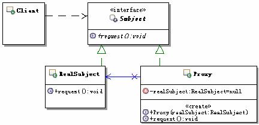

#代理设计模式

定义：为其它对象提供一种代理以控制对这个对象的访问。

结构：

* Proxy：代理对象，通常具有如下功能：

	实现与具体的目标对象一样的接口，这样就可以使用代理来代替具体的目标对象
	保存一个指向具体目标对象的引用，可以在需要的时候调用具体的目标对象
可以控制对具体目标对象的访问，并可能负责创建和删除它
* Subject：目标接口
	
	定义代理和具体目标对象的接口，这样就可以在任何使用具体目标对象的地方使用代理对象
* RealSubject：具体的目标对象
	
	真正实现目标接口要求的功能。在运行时刻一种可能的代理结构的对象图