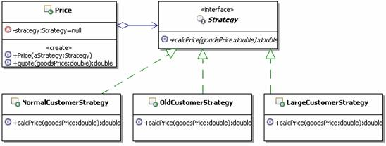

#策略设计模式

定义：定义一系列的算法，把它们一个个封装起来，并使它们可相互替换。这个模式可以使得算法可独立于使用它的客户而变化。（把每一个算法包装成一个独立的对象，算法之间可项目替换。）

结构


* Strategy：
        
	策略接口，用来约束一系列具体的策略算法。Context使用这个接口来调用具体的策略实现定义的算法。
* ConcreteStrategy：
        
	具体的策略实现，也就是具体的算法实现。
* Context：
       
	上下文，**负责和具体的策略类交互，通常上下文会持有一个真正的策略实现**，上下文还可以让具体的策略类来获取上下文的数据，甚至让具体的策略类来回调上下文的方法。

[**策略模式的参考实现**](https://github.com/timosang/AndroidDemo/tree/master/DesignPattern/%E7%AD%96%E7%95%A5%E8%AE%BE%E8%AE%A1%E6%A8%A1%E5%BC%8F/code/example3)：

定义算法的接口

```java
/**
 * 策略，定义算法的接口
 */
public interface Strategy {
	/**
	 * 某个算法的接口，可以有传入参数，也可以有返回值
	 */
	public void algorithmInterface();
}

```
算法的A、B、C
```
/**
 * 实现具体的算法
 */
public class ConcreteStrategyA implements Strategy {

	public void algorithmInterface() {
		//具体的算法实现		
	}
	
}

```

上下文对象
```java
/**
 * 上下文对象，通常会持有一个具体的策略对象
 */
public class Context {
	/**
	 * 持有一个具体的策略对象
	 */
	private Strategy strategy;
	/**
	 * 构造方法，传入一个具体的策略对象
	 * @param aStrategy 具体的策略对象
	 */
	public Context(Strategy aStrategy) {
		this.strategy = aStrategy;
	}
	/**
	 * 上下文对客户端提供的操作接口，可以有参数和返回值
	 */
	public void contextInterface() {
		//通常会转调具体的策略对象进行算法运算
		strategy.algorithmInterface();
	}

}

```

##实例应用：报价管理

向客户报价，对于销售部门的人来讲，这是一个非常重大、非常复杂的问题，对不同的客户要报不同的价格，比如：

* 对普通客户或者是新客户报的是全价
* 对老客户报的价格，根据客户年限，给予一定的折扣
* 对大客户报的价格，根据大客户的累计消费金额，给予一定的折扣

还要考虑客户购买的数量和金额，比如：虽然是新用户，但是一次购买的数量非常大，或者是总金额非常高，也会有一定的折扣
还有，报价人员的职务高低，也决定了他是否有权限对价格进行一定的浮动折扣甚至在不同的阶段，对客户的报价也不同，一般情况是刚开始比较高，越接近成交阶段，报价越趋于合理。 
        
总之，向客户报价是非常复杂的，因此在一些CRM（客户关系管理）的系统中，会有一个单独的报价管理模块，来处理复杂的报价功能。 
        
为了演示的简洁性，假定现在需要实现一个简化的报价管理，实现如下的功能： 
   
   1. 对普通客户或者是新客户报全价 
   2. 对老客户报的价格，统一折扣5% 
   3. 对大客户报的价格，统一折扣10% 

###不用模式的处理

要实现对不同的人员报不同的价格的功能，无外乎就是判断起来麻烦点，也不多难，很快就有朋友能写出如下的实现代码，示例代码如下：

```java
/**
* 价格管理，主要完成计算向客户所报价格的功能
*/
public class Price {
    /**
    * 报价，对不同类型的，计算不同的价格
    * @param goodsPrice 商品销售原价
    * @param customerType 客户类型
    * @return 计算出来的，应该给客户报的价格
    */
    public double quote(double goodsPrice,String customerType){
       if(customerType.equals("普通客户 ")){
           System.out.println("对于新客户或者是普通客户，没有折扣 ");
           return goodsPrice;
       }else if(customerType.equals("老客户 ")){
           System.out.println("对于老客户，统一折扣 5%");
           return goodsPrice*(1-0.05);
       }else if(customerType.equals("大客户 ")){
           System.out.println("对于大客户，统一折扣 10%");
           return goodsPrice*(1-0.1);        
       }
       //其余人员都是报原价
       return goodsPrice;
    }
}

```

上面的写法是很简单的，也很容易想，但是仔细想想，这样实现，问题可不小，比如：

* 第一个问题：价格类包含了所有计算报价的算法，使得价格类，尤其是报价这个方法比较庞杂，难以维护。
	
	这样的话把这些算法从报价方法里面拿出去，形成独 立的方法不就可以解决这个问题了吗？据此写出如下的实现代码，示例代码如下：

	```java
		/**
	* 价格管理，主要完成计算向客户所报价格的功能
	*/
	public class Price {
	    /**
	    * 报价，对不同类型的，计算不同的价格
	    * @param goodsPrice 商品销售原价
	    * @param customerType 客户类型
	    * @return 计算出来的，应该给客户报的价格
	    */
	    public double quote(double goodsPrice,String customerType){
	       if(customerType.equals("普通客户 ")){
	           return this.calcPriceForNormal(goodsPrice);
	       }else if(customerType.equals("老客户 ")){
	           return this.calcPriceForOld(goodsPrice);
	       }else if(customerType.equals("大客户 ")){
	           return this.calcPriceForLarge(goodsPrice);       
	       }
	       //其余人员都是报原价
	       return goodsPrice;
	    }
	    /**
	    * 为新客户或者是普通客户计算应报的价格
	    * @param goodsPrice 商品销售原价
	    * @return 计算出来的，应该给客户报的价格
	    */
	    private double calcPriceForNormal(double goodsPrice){
	       System.out.println("对于新客户或者是普通客户，没有折扣 ");
	       return goodsPrice;
	    }
	    /**
	    * 为老客户计算应报的价格
	    * @param goodsPrice 商品销售原价
	    * @return 计算出来的，应该给客户报的价格
	    */
	    private double calcPriceForOld(double goodsPrice){
	       System.out.println("对于老客户，统一折扣 5%");
	       return goodsPrice*(1-0.05);
	    }
	    /**
	    * 为大客户计算应报的价格
	    * @param goodsPrice 商品销售原价
	    * @return 计算出来的，应该给客户报的价格
	    */
	    private double calcPriceForLarge(double goodsPrice){
	       System.out.println("对于大客户，统一折扣 10%");
	       return goodsPrice*(1-0.1); 
	    }
	}
	
	```


	比刚开始稍稍好点，计算报价的方法会稍稍简单一点，这样维护起来也稍好一些，某个算法发生了变化，直接修改相应的私有方法就可以了。扩展起来也容易一点，比如要增加一个“战略合作客户”的类型，报价为直接8折，就只需要在价格类里面新增加一个私有的方法来计算新的价格，然后在计算报价的方法里面新添一个else-if即可。看起来似乎很不错了。 
    
    再想想，问题还是存在，只不过从计算报价的方法挪动到价格类里面了，假如有100个或者更多这样的计算方式，这会让这个价格类非常庞大，难以维护。而且，维护和扩展都需要去修改已有的代码，这是很不好的，违反了开-闭原则。

* 第二个问题

	经常会有这样的需要，在不同的时候，要使用不同的计算方式。
    
	比如：在公司周年庆的时候，所有的客户额外增加3%的折扣；在换季促销的时候，普通客户是额外增加折扣2%，老客户是额外增加折扣3%，大客户是额外增加折扣5%。这意味着计算报价的方式会经常被修改，或者被切换。 
        
	通常情况下应该是被切换，因为过了促销时间，又还回到正常的价格体系上来了。而现在的价格类中计算报价的方法，是固定调用各种计算方式，这使得切换调用不同的计算方式很麻烦，每次都需要修改if-else里面的调用代码。 

###应用策略模式解决

仔细分析上面的问题，先来把它抽象一下，各种计算报价的计算方式就好比是具体的算法，而使用这些计算方式来计算报价的程序，就相当于是使用算法的客户。
        
再分析上面的实现方式，为什么会造成那些问题，根本原因，**就在于算法和使用算法的客户是耦合的，甚至是密不可分的**，在上面实现中，具体的算法和使用算法的客户是同一个类里面的不同方法。
        
现在要解决那些问题，**按照策略模式的方式，应该先把所有的计算方式独 立出来，每个计算方式做成一个单独的算法类，从而形成一系列的算法，并且为这一系列算法定义一个公共的接口，这些算法实现是同一接口的不同实现，地位是平等的，可以相互替换。**这样一来，要扩展新的算法就变成了增加一个新的算法实现类，要维护某个算法，也只是修改某个具体的算法实现即可，不会对其它代码造成影响。也就是说这样就解决了可维护、可扩展的问题。

为了实现让算法能独 立于使用它的客户，策略模式引入了一个上下文的对象，这个对象负责持有算法，但是不负责决定具体选用哪个算法，把选择算法的功能交给了客户，由客户选择好具体的算法后，设置到上下文对象里面，让上下文对象持有客户选择的算法，当客户通知上下文对象执行功能的时候，上下文对象会去转调具体的算法。这样一来，具体的算法和直接使用算法的客户是分离的。
        
**具体的算法和使用它的客户分离过后，使得算法可独 立于使用它的客户而变化，并且能够动态的切换需要使用的算法，只要客户端动态的选择使用不同的算法，然后设置到上下文对象中去，实际调用的时候，就可以调用到不同的算法。**（上下文只负责持有算法，真正的使用那个算法由客户决定。）

解决方案的类图



[**解决方案的代码实现**](https://github.com/timosang/AndroidDemo/tree/master/DesignPattern/%E7%AD%96%E7%95%A5%E8%AE%BE%E8%AE%A1%E6%A8%A1%E5%BC%8F/code/example4)

定义计算报价算法的接口

```java
/**
 * 策略，定义计算报价算法的接口
 */
public interface Strategy {
	/**
	 * 计算应报的价格
	 * @param goodsPrice 商品销售原价
	 * @return 计算出来的，应该给客户报的价格
	 */
	public double calcPrice(double goodsPrice);
}

```
定义具体的算法实现A、B、C、D

```java
public class CooperateCustomerStrategy implements Strategy{
	public double calcPrice(double goodsPrice) {
		System.out.println("对于战略合作客户，统一8折");
		return goodsPrice*0.8;
	}
}


```

价格管理：持有一个具体的策略对象

```java
/**
 * 价格管理，主要完成计算向客户所报价格的功能
 */
public class Price {
	/**
	 * 持有一个具体的策略对象
	 */
	private Strategy strategy = null;
	/**
	 * 构造方法，传入一个具体的策略对象
	 * @param aStrategy 具体的策略对象
	 */
	public Price(Strategy aStrategy){
		this.strategy = aStrategy;
	}	
	/**
	 * 报价，计算对客户的报价
	 * @param goodsPrice 商品销售原价
	 * @return 计算出来的，应该给客户报的价格
	 */
	public double quote(double goodsPrice){
		return this.strategy.calcPrice(goodsPrice);
	}
}
```


客户端选择：

```java
public class Client {
	public static void main(String[] args) {
		// 1：选择并创建需要使用的策略对象
		Strategy strategy = new OldCustomerStrategy();
		// 2：创建上下文
		Price ctx = new Price(strategy);

		// 3：计算报价
		double quote = ctx.quote(1000);
		System.out.println("向客户报价：" + quote);

		// 1：选择并创建需要使用的策略对象
		Strategy strategy1 = new CooperateCustomerStrategy();
		// 2：创建上下文
		Price ctx1 = new Price(strategy1);

		// 3：计算报价
		double quote1 = ctx1.quote(1000);
		System.out.println("向客户报价：" + quote1);
	}
}

```

结果:
	
	对于老客户，统一折扣5%
	向客户报价：950.0
	对于战略合作客户，统一8折
	向客户报价：800.0


##理解策略模式

###策略模式的功能

策略模式的功能是把具体的算法实现，从具体的业务处理里面独立出来，把它们实现成为单独的算法类，从而形成一系列的算法，并让这些**算法可以相互替换。**
        
**策略模式的重心不是如何来实现算法，而是如何组织、调用这些算法**，从而让程序结构更灵活、具有更好的维护性和扩展性。

###策略模式和if-else语句
        

看了前面的示例，很多朋友会发现，每个策略算法具体实现的功能，就是原来在if-else结构中的具体实现。

没错，其实多个if-elseif语句表达的就是一个平等的功能结构，你要么执行if，要不你就执行else，或者是elseif，这个时候，if块里面的实现和else块里面的实现从运行地位上来讲就是平等的。
        
而**策略模式就是把各个平等的具体实现封装到单独的策略实现类**了，然后**通过上下文来与具体的策略类进行交互**。

因此**多个if-else语句可以考虑使用策略模式**。（策略模式就是把各个平等的具体实现封装到单独的策略实现类。）

###算法的平等性
        
策略模式一个很大的特点就是**各个策略算法的平等性**。对于一系列具体的策略算法，大家的地位是完全一样的，正是因为这个平等性，才能**实现算法之间可以相互替换。**（因为策略算法的平等性，实现算法之间可以相互替换。）
        
所有的策略算法在实现上也是相互独立的，相互之间是没有依赖的。
        
所以可以这样描述这一系列策略算法：**策略算法是相同行为的不同实现**。


###谁来选择具体的策略算法
        
在策略模式中，可以在两个地方来进行具体策略的选择。（客户端或上下文来选择具体的策略算法）
        
一个是在**客户端**，在使用上下文的时候，由客户端来选择具体的策略算法，然后把这个策略算法设置给上下文。前面的示例就是这种情况。
        
还有一个是客户端不管，由**上下文来选择具体的策略算法**，这个在后面讲容错恢复的时候给大家演示一下。

一般情况下是在客户端选择具体的策略算法。


###Strategy的实现方式
        
在前面的示例中，Strategy都是使用的接口来定义的，这也是常见的实现方式。但是如果多个算法具有公共功能的话，可以把Strategy实现成为抽象类，然后把多个算法的公共功能实现到Strategy里面。（既要约束子类功能，又要向子类提供公共功能的时候，选择抽象类。）

###运行时策略的唯一性
        
运行期间，策略模式在每一个时刻只能使用一个具体的策略实现对象，虽然可以动态的在不同的策略实现中切换，但是同时只能使用一个。

###增加新的策略(可扩展性)
        
在前面的示例里面，体会到了策略模式中切换算法的方便，但是增加一个新的算法会怎样呢？比如现在要实现如下的功能：对于公司的“战略合作客户”，统一8折。
        
其实很简单，策略模式可以让你很灵活的扩展新的算法。具体的做法是：先写一个策略算法类来实现新的要求，然后在客户端使用的时候指定使用新的策略算法类就可以了。

还是通过示例来说明。先添加一个实现要求的策略类，示例代码如下：

```java

/**
* 具体算法实现，为战略合作客户客户计算应报的价格
*/
public class CooperateCustomerStrategy implements Strategy{
    public double calcPrice(double goodsPrice) {
       System.out.println("对于战略合作客户，统一8折");
       return goodsPrice*0.8;
    }
}

```

然后在客户端指定使用策略的时候指定新的策略算法实现，示例如下：

```java
public class Client2 {
    public static void main(String[] args) {
       //1：选择并创建需要使用的策略对象
       Strategy strategy = new CooperateCustomerStrategy ();
       //2：创建上下文
           Price ctx = new Price(strategy);
      
       //3：计算报价
       double quote = ctx.quote(1000);
       System.out.println("向客户报价："+quote);
    }
}

```

  除了客户端发生变化外，已有的上下文、策略接口定义和策略的已有实现，都不需要做任何的修改，可见能很方便的扩展新的策略算法。


###策略模式调用顺序示意图

策略模式的调用顺序，有两种常见的情况，一种如同前面的示例，具体如下：

1. 先是客户端来选择并创建具体的策略对象(Strategy strategy = new CooperateCustomerStrategy ();)
2. 然后客户端创建上下文( Price ctx = new Price(strategy);)
3. 接下来客户端就可以调用上下文的方法来执行功能了，在调用的时候，从客户端传入算法需要的参数(double quote = ctx.quote(1000);)
4. 上下文接到客户的调用请求，会把这个请求转发给它持有的Strategy

		public double quote(double goodsPrice){
			return this.strategy.calcPrice(goodsPrice);
		}


策略模式调用还有一种情况，就是把Context当做参数来传递给Strategy，这种方式的调用顺序图，在讲具体的Context和Strategy的关系时再给出。

## Context和Strategy的关系

  
在策略模式中，通常是上下文使用具体的策略实现对象，反过来，策略实现对象也可以从上下文获取所需要的数据，因此**可以将上下文当参数传递给策略实现对象，这种情况下上下文和策略实现对象是紧密耦合的。**
       
在这种情况下，上下文封装着具体策略对象进行算法运算所需要的数据，具体策略对象通过回调上下文的方法来获取这些数据。（上下文封装着客户端请求的参数。）
       
 甚至在某些情况下，策略实现对象还可以回调上下文的方法来实现一定的功能，这种使用场景下，**上下文变相充当了多个策略算法实现的公共接口，在上下文定义的方法可以当做是所有或者是部分策略算法使用的公共功能**。
       
 但是请注意，由于所有的策略实现对象都实现同一个策略接口，传入同一个上下文，可能会造成传入的上下文数据的浪费，因为有的算法会使用这些数据，而有的算法不会使用，但是上下文和策略对象之间交互的开销是存在的了。（上下文传递到具体某一个的策略算法中，部分数据是没有用的，造成了上下文和策略对象之间的交互的开销是客观存在的。）
	
###工资支付案例

  考虑这样一个功能：工资支付方式的问题，很多企业的工资支付方式是很灵活的，可支付方式是比较多的，比如：人民币现金支付、美元现金支付、银行转账到工资帐户、银行转账到工资卡；一些创业型的企业为了留住骨干员工，还可能有：工资转股权等等方式。总之一句话，工资支付方式很多。（第一个问题，工资支付方式很多）

  随着公司的发展，会不断有新的工资支付方式出现，这就要求能方便的扩展；另外工资支付方式不是固定的，是由公司和员工协商确定的，也就是说可能不同的员工采用的是不同的支付方式，甚至同一个员工，不同时间采用的支付方式也可能会不同，这就要求能很方便的切换具体的支付方式。（第二个问题，可扩展、方便的切换具体的支付方式。）
        
  要实现这样的功能，策略模式是一个很好的选择。**在实现这个功能的时候，不同的策略算法需要的数据是不一样**，比如：现金支付就不需要银行帐号，而银行转账就需要帐号。这就导致在设计策略接口中的方法时，不太好确定参数的个数，而且，就算现在把所有的参数都列上了，今后扩展呢？难道再来修改策略接口吗？如果这样做，那无异于一场灾难，加入一个新策略，就需要修改接口，然后修改所有已有的实现，不疯掉才怪！那么到底如何实现，在今后扩展的时候才最方便呢？	

  **解决方案之一，就是把上下文当做参数传递给策略对象，这样一来，如果要扩展新的策略实现，只需要扩展上下文就可以了，已有的实现不需要做任何的修改**

  这样是不是能很好的实现功能，并具有很好的扩展性呢？还是通过代码示例来具体的看。假设先实现人民币现金支付和美元现金支付这两种支付方式，然后就进行使用测试，然后再来添加银行转账到工资卡的支付方式，看看是不是能很容易的与已有的实现结合上。

[**具体实现**](https://github.com/timosang/AndroidDemo/tree/master/DesignPattern/%E7%AD%96%E7%95%A5%E8%AE%BE%E8%AE%A1%E6%A8%A1%E5%BC%8F/code/example5)


支付工资策略的接口

```java
/**
 * 支付工资的策略的接口，公司有多种支付工资的算法
 * 比如：现金、银行卡、现金加股票、现金加期权、美元支付等等
 */
public interface PaymentStrategy {
	/**
	 * 公司给某人真正支付工资
	 * @param ctx 支付工资的上下文，里面包含算法需要的数据
	 */
	public void pay(PaymentContext ctx);
}


```

注意pay方法中传入的参数PaymentContext，支付工资的上下文，里面包含着算法需要的数据

人民币现金支付和美元现金支付

```java

/**
 * 人民币现金支付
 */
public class RMBCash implements PaymentStrategy{
	
	public void pay(PaymentContext ctx) {
		System.out.println("现在给"+ctx.getUserName()+"人民币现金支付"+ctx.getMoney()+"元");
	}

}

```

支付工资上下文

```java
/**
 * 支付工资的上下文，每个人的工资不同，支付方式也不同
 */
public class PaymentContext {
	/**
	 * 应被支付工资的人员，简单点，用姓名来代替
	 */
	private String userName = null;
	/**
	 * 应被支付的工资的金额
	 */
	private double money = 0.0;
	/**
	 * 支付工资的方式策略的接口
	 */
	private PaymentStrategy strategy = null;
	/**
	 * 构造方法，传入被支付工资的人员，应支付的金额和具体的支付策略
	 * @param userName 被支付工资的人员
	 * @param money 应支付的金额
	 * @param strategy 具体的支付策略
	 */
	public PaymentContext(String userName,double money,PaymentStrategy strategy){
		this.userName = userName;
		this.money = money;
		this.strategy = strategy;
	}

	/**
	 * 立即支付工资
	 */
	public void payNow(){
		//使用客户希望的支付策略来支付工资
		this.strategy.pay(this);
	}
	public String getUserName() {
		return userName;
	}

	public double getMoney() {
		return money;
	}
}


```

userName、Money和PaymentStrategy是客户端通过构造方法需要传入的参数，调用payNow方法()。

客户端

```java
public class Client {
	public static void main(String[] args) {
		//创建相应的支付策略
		PaymentStrategy strategyRMB = new RMBCash();
		PaymentStrategy strategyDollar = new DollarCash();
		
		//准备小李的支付工资上下文
		PaymentContext ctx1 = new PaymentContext("小李",5000,strategyRMB);
		//向小李支付工资
		ctx1.payNow();
		
		//切换一个人，给petter支付工资
		PaymentContext ctx2 = new PaymentContext("Petter",8000,strategyDollar);
		ctx2.payNow();
		
		//测试新添加的支付方式
		PaymentStrategy strategyCard = new Card();
		PaymentContext ctx3 = new PaymentContext2("小王",9000,"010998877656",strategyCard);
		ctx3.payNow();
		
		//测试新添加的支付方式
		PaymentStrategy strategyCard2 = new Card2("010998877656");
		PaymentContext ctx4 = new PaymentContext("小张",9000,strategyCard2);
		ctx4.payNow();
	}
}


```


运行结果

	现在给小李人民币现金支付5000.0元
	现在给Petter美元现金支付8000.0元
	现在给小王的010998877656帐号支付了9000.0元
	现在给小张的010998877656帐号支付了9000.0元


整体思路：

1. 先定义好工资支付的策略接口（就是定义一个支付工资的方法）
2. 定义好了工资支付的策略接口，考虑如何实现这多种支付策略。
3. 实现使用支付策略的上下文，是需要知道具体使用哪一个支付策略的，一般由客户端来确定具体使用哪一个具体的策略，然后上下文负责去真正执行。因此，这个上下文需要持有一个支付策略，而且是由客户端来配置它。
4. 准备好了支付工资的各种策略，客户端是使用上下文来使用具体的策略的，而且是客户端来确定具体的策略，就是客户端创建哪个策略，最终就运行哪一个策略，各个策略之间是可以动态切换的。

自己选算法，通过上下文把数据传入进去。把上下文当做参数传入给策略对象，策略对象通过回调上下文的方法来执行策略对象公共的功能。（传入ctx，上下文的公共方法，ctx.getMoney()和ctx.getUserName()）

```java

/**
 * 人民币现金支付
 */
public class RMBCash implements PaymentStrategy{
	
	public void pay(PaymentContext ctx) {
		System.out.println("现在给"+ctx.getUserName()+"人民币现金支付"+ctx.getMoney()+"元");
	}

}

```


###扩展实例：实现方式一 
        
经过上面的测试可以看出，通过使用策略模式，已经实现好了两种支付方式了。如果现在要增加一种支付方式，要求能支付到银行卡，该怎么扩展最简单呢？ 
        
应该新增加一种支付到银行卡的策略实现，然后通过继承来扩展支付上下文，在里面添加新的支付方式需要的新的数据，比如银行卡账户，然后在客户端使用新的上下文和新的策略实现就可以了，这样已有的实现都不需要改变，完全遵循开-闭原则。 
        
先看看扩展的支付上下文对象的实现，示例代码如下：


```java
/**
* 扩展的支付上下文对象
*/
public class PaymentContext2 extends PaymentContext {
    /**
    * 银行帐号
    */
    private String account = null;
    /**
    * 构造方法，传入被支付工资的人员，应支付的金额和具体的支付策略
    * @param userName 被支付工资的人员
    * @param money 应支付的金额
    * @param account 支付到的银行帐号
    * @param strategy 具体的支付策略
    */
    public PaymentContext2(String userName,double money,
String account,PaymentStrategy strategy){
       super(userName,money,strategy);
       this.account = account;
    }
    public String getAccount() {
       return account;
    }
}

```

新的策略算法的实现，示例代码如下：


```java

/**
* 支付到银行卡
*/
public class Card implements PaymentStrategy{
    public void pay(PaymentContext ctx) {
       // 这个新的算法自己知道要使用扩展的支付上下文，所以强制造型一下
       PaymentContext2 ctx2 = (PaymentContext2)ctx;
       System.out.println(" 现在给 "+ctx2.getUserName()+" 的 "
+ctx2.getAccount()+" 帐号支付了 "+ctx2.getMoney()+" 元 ");
       // 连接银行，进行转帐，就不去管了
    }
}
```

客户端：原有的代码不变，直接添加新的测试就可以了

```java
public class Client {
    public static void main(String[] args) {
       //创建相应的支付策略
       PaymentStrategy strategyRMB = new RMBCash();
       PaymentStrategy strategyDollar = new DollarCash();
      
       //准备小李的支付工资上下文
       PaymentContext ctx1 =
new PaymentContext("小李 ",5000,strategyRMB);
       //向小李支付工资
       ctx1.payNow();
      
       //切换一个人，给 petter支付工资
       PaymentContext ctx2 =
new PaymentContext("Petter",8000,strategyDollar);
       ctx2.payNow();
      
       // 测试新添加的支付方式
       PaymentStrategy strategyCard = new Card();
       PaymentContext ctx3 = new PaymentContext2(
"小王",9000,"010998877656",strategyCard);
       ctx3.payNow();
    }
}

```

###扩展示例：实现方式二

现在要增加一种支付方式，要求能支付到银行卡。 
（1）上面这种实现方式，是通过扩展上下文对象来准备新的算法需要的数据。还有另外一种方式，那就是通过策略的构造方法来传入新算法需要的数据。这样实现的话，就不需要扩展上下文了，直接添加新的策略算法实现就好了。示例代码如下：