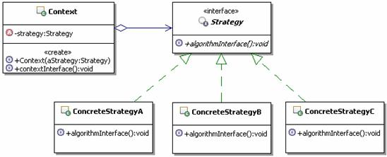

#策略设计模式

定义：定义一系列的算法，把它们一个个封装起来，并使它们可相互替换。这个模式可以使得算法可独立于使用它的客户而变化。（把每一个算法包装成一个独立的对象，算法之间可项目替换。）

结构



* Strategy：
        
	策略接口，用来约束一系列具体的策略算法。Context使用这个接口来调用具体的策略实现定义的算法。
* ConcreteStrategy：
        
	具体的策略实现，也就是具体的算法实现。
* Context：
       
	上下文，**负责和具体的策略类交互，通常上下文会持有一个真正的策略实现**，上下文还可以让具体的策略类来获取上下文的数据，甚至让具体的策略类来回调上下文的方法。

[**策略模式的参考实现**](https://github.com/timosang/AndroidDemo/tree/master/DesignPattern/%E7%AD%96%E7%95%A5%E8%AE%BE%E8%AE%A1%E6%A8%A1%E5%BC%8F/code/example3)：

定义算法的接口

```java
/**
 * 策略，定义算法的接口
 */
public interface Strategy {
	/**
	 * 某个算法的接口，可以有传入参数，也可以有返回值
	 */
	public void algorithmInterface();
}

```
算法的A、B、C
```
/**
 * 实现具体的算法
 */
public class ConcreteStrategyA implements Strategy {

	public void algorithmInterface() {
		//具体的算法实现		
	}
	
}

```

上下文对象
```java
/**
 * 上下文对象，通常会持有一个具体的策略对象
 */
public class Context {
	/**
	 * 持有一个具体的策略对象
	 */
	private Strategy strategy;
	/**
	 * 构造方法，传入一个具体的策略对象
	 * @param aStrategy 具体的策略对象
	 */
	public Context(Strategy aStrategy) {
		this.strategy = aStrategy;
	}
	/**
	 * 上下文对客户端提供的操作接口，可以有参数和返回值
	 */
	public void contextInterface() {
		//通常会转调具体的策略对象进行算法运算
		strategy.algorithmInterface();
	}

}

```

##实例应用：报价管理

向客户报价，对于销售部门的人来讲，这是一个非常重大、非常复杂的问题，对不同的客户要报不同的价格，比如：

* 对普通客户或者是新客户报的是全价
* 对老客户报的价格，根据客户年限，给予一定的折扣
* 对大客户报的价格，根据大客户的累计消费金额，给予一定的折扣

还要考虑客户购买的数量和金额，比如：虽然是新用户，但是一次购买的数量非常大，或者是总金额非常高，也会有一定的折扣
还有，报价人员的职务高低，也决定了他是否有权限对价格进行一定的浮动折扣甚至在不同的阶段，对客户的报价也不同，一般情况是刚开始比较高，越接近成交阶段，报价越趋于合理。 
        
总之，向客户报价是非常复杂的，因此在一些CRM（客户关系管理）的系统中，会有一个单独的报价管理模块，来处理复杂的报价功能。 
        
为了演示的简洁性，假定现在需要实现一个简化的报价管理，实现如下的功能： 
   
   1. 对普通客户或者是新客户报全价 
   2. 对老客户报的价格，统一折扣5% 
   3. 对大客户报的价格，统一折扣10% 

###不用模式的处理

要实现对不同的人员报不同的价格的功能，无外乎就是判断起来麻烦点，也不多难，很快就有朋友能写出如下的实现代码，示例代码如下：

```java
/**
* 价格管理，主要完成计算向客户所报价格的功能
*/
public class Price {
    /**
    * 报价，对不同类型的，计算不同的价格
    * @param goodsPrice 商品销售原价
    * @param customerType 客户类型
    * @return 计算出来的，应该给客户报的价格
    */
    public double quote(double goodsPrice,String customerType){
       if(customerType.equals("普通客户 ")){
           System.out.println("对于新客户或者是普通客户，没有折扣 ");
           return goodsPrice;
       }else if(customerType.equals("老客户 ")){
           System.out.println("对于老客户，统一折扣 5%");
           return goodsPrice*(1-0.05);
       }else if(customerType.equals("大客户 ")){
           System.out.println("对于大客户，统一折扣 10%");
           return goodsPrice*(1-0.1);        
       }
       //其余人员都是报原价
       return goodsPrice;
    }
}

```

上面的写法是很简单的，也很容易想，但是仔细想想，这样实现，问题可不小，比如：

* 第一个问题：价格类包含了所有计算报价的算法，使得价格类，尤其是报价这个方法比较庞杂，难以维护。
	
	这样的话把这些算法从报价方法里面拿出去，形成独 立的方法不就可以解决这个问题了吗？据此写出如下的实现代码，示例代码如下：

	```java
		/**
	* 价格管理，主要完成计算向客户所报价格的功能
	*/
	public class Price {
	    /**
	    * 报价，对不同类型的，计算不同的价格
	    * @param goodsPrice 商品销售原价
	    * @param customerType 客户类型
	    * @return 计算出来的，应该给客户报的价格
	    */
	    public double quote(double goodsPrice,String customerType){
	       if(customerType.equals("普通客户 ")){
	           return this.calcPriceForNormal(goodsPrice);
	       }else if(customerType.equals("老客户 ")){
	           return this.calcPriceForOld(goodsPrice);
	       }else if(customerType.equals("大客户 ")){
	           return this.calcPriceForLarge(goodsPrice);       
	       }
	       //其余人员都是报原价
	       return goodsPrice;
	    }
	    /**
	    * 为新客户或者是普通客户计算应报的价格
	    * @param goodsPrice 商品销售原价
	    * @return 计算出来的，应该给客户报的价格
	    */
	    private double calcPriceForNormal(double goodsPrice){
	       System.out.println("对于新客户或者是普通客户，没有折扣 ");
	       return goodsPrice;
	    }
	    /**
	    * 为老客户计算应报的价格
	    * @param goodsPrice 商品销售原价
	    * @return 计算出来的，应该给客户报的价格
	    */
	    private double calcPriceForOld(double goodsPrice){
	       System.out.println("对于老客户，统一折扣 5%");
	       return goodsPrice*(1-0.05);
	    }
	    /**
	    * 为大客户计算应报的价格
	    * @param goodsPrice 商品销售原价
	    * @return 计算出来的，应该给客户报的价格
	    */
	    private double calcPriceForLarge(double goodsPrice){
	       System.out.println("对于大客户，统一折扣 10%");
	       return goodsPrice*(1-0.1); 
	    }
	}
	
	```


	比刚开始稍稍好点，计算报价的方法会稍稍简单一点，这样维护起来也稍好一些，某个算法发生了变化，直接修改相应的私有方法就可以了。扩展起来也容易一点，比如要增加一个“战略合作客户”的类型，报价为直接8折，就只需要在价格类里面新增加一个私有的方法来计算新的价格，然后在计算报价的方法里面新添一个else-if即可。看起来似乎很不错了。 
    
    再想想，问题还是存在，只不过从计算报价的方法挪动到价格类里面了，假如有100个或者更多这样的计算方式，这会让这个价格类非常庞大，难以维护。而且，维护和扩展都需要去修改已有的代码，这是很不好的，违反了开-闭原则。

* 第二个问题

	经常会有这样的需要，在不同的时候，要使用不同的计算方式。
    
	比如：在公司周年庆的时候，所有的客户额外增加3%的折扣；在换季促销的时候，普通客户是额外增加折扣2%，老客户是额外增加折扣3%，大客户是额外增加折扣5%。这意味着计算报价的方式会经常被修改，或者被切换。 
        
	通常情况下应该是被切换，因为过了促销时间，又还回到正常的价格体系上来了。而现在的价格类中计算报价的方法，是固定调用各种计算方式，这使得切换调用不同的计算方式很麻烦，每次都需要修改if-else里面的调用代码。 

###应用策略模式解决

仔细分析上面的问题，先来把它抽象一下，各种计算报价的计算方式就好比是具体的算法，而使用这些计算方式来计算报价的程序，就相当于是使用算法的客户。
        
再分析上面的实现方式，为什么会造成那些问题，根本原因，**就在于算法和使用算法的客户是耦合的，甚至是密不可分的**，在上面实现中，具体的算法和使用算法的客户是同一个类里面的不同方法。
        
现在要解决那些问题，**按照策略模式的方式，应该先把所有的计算方式独 立出来，每个计算方式做成一个单独的算法类，从而形成一系列的算法，并且为这一系列算法定义一个公共的接口，这些算法实现是同一接口的不同实现，地位是平等的，可以相互替换。**这样一来，要扩展新的算法就变成了增加一个新的算法实现类，要维护某个算法，也只是修改某个具体的算法实现即可，不会对其它代码造成影响。也就是说这样就解决了可维护、可扩展的问题。

为了实现让算法能独 立于使用它的客户，策略模式引入了一个上下文的对象，这个对象负责持有算法，但是不负责决定具体选用哪个算法，把选择算法的功能交给了客户，由客户选择好具体的算法后，设置到上下文对象里面，让上下文对象持有客户选择的算法，当客户通知上下文对象执行功能的时候，上下文对象会去转调具体的算法。这样一来，具体的算法和直接使用算法的客户是分离的。
        
具体的算法和使用它的客户分离过后，使得算法可独 立于使用它的客户而变化，并且能够动态的切换需要使用的算法，只要客户端动态的选择使用不同的算法，然后设置到上下文对象中去，实际调用的时候，就可以调用到不同的算法。（上下文只负责持有算法，真正的使用那个算法由客户决定。）

