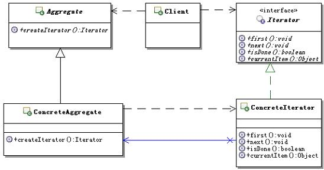

#迭代器设计模式

定义：**提供一种方法顺序访问一个聚合对象中各个元素，而又不需暴露该对象的内部表示。**

所谓聚合：指一组对象的组合结构，比如：Java中的集合、数组等。

模式的结构和说明：



* **Iterator：迭代器接口**。

	定义访问和遍历元素的接口。

* **ConcreteIterator：具体的迭代器实现对象**。

	实现对聚合对象的遍历，并跟踪遍历时的当前位置。

* **Aggregate：聚合对象**。

	定义创建相应迭代器对象的接口。

* **ConcreteAggregate:具体聚合对象**。

	实现创建相应的迭代器对象


具体实现：

迭代器接口

```java
/**
 * 迭代器接口，定义访问和遍历元素的操作
 */
public interface Iterator {
	/**
	 * 移动到聚合对象的第一个位置
	 */
	public void first();
	/**
	 * 移动到聚合对象的下一个位置
	 */
	public void next();
	/**
	 * 判断是否已经移动聚合对象的最后一个位置
	 * @return true表示已经移动到聚合对象的最后一个位置，
	 *         false表示还没有移动到聚合对象的最后一个位置
	 */
	public boolean isDone();
	/**
	 * 获取迭代的当前元素
	 * @return 迭代的当前元素
	 */
	public Object currentItem();
}

```

具体的迭代器实现对象:

具体的迭代器实现对象需要持有被迭代的具体的聚合对象。而不需要暴露对象的内部实现，指的是不对客户端暴露对象的内部实现。

```java
/**
 * 具体迭代器实现对象，示意的是聚合对象为数组的迭代器
 * 不同的聚合对象相应的迭代器实现是不一样的
 */
public class ConcreteIterator implements Iterator {
	/**
	 * 持有被迭代的具体的聚合对象
	 */
	private ConcreteAggregate aggregate;
	/**
	 * 内部索引，记录当前迭代到的索引位置。
	 * -1表示刚开始的时候，迭代器指向聚合对象第一个对象之前
	 */
	private int index = -1;
	/**
	 * 构造方法，传入被迭代的具体的聚合对象
	 * @param aggregate 被迭代的具体的聚合对象
	 */
	public ConcreteIterator(ConcreteAggregate aggregate) {
		this.aggregate = aggregate;
	}

	public void first(){
		index = 0;
	}
	public void next(){
		if(index < this.aggregate.size()){
			index = index + 1;
		}
	}
	public boolean isDone(){
		if(index == this.aggregate.size()){
			return true;
		}
		return false;
	}
	public Object currentItem(){
		return this.aggregate.get(index);
	}
}

```

聚合对象的接口

```java
/**
 * 聚合对象的接口，定义创建相应迭代器对象的接口
 */
public abstract class Aggregate {
	/**
	 * 工厂方法，创建相应迭代器对象的接口
	 * @return 相应迭代器对象的接口
	 */
	public abstract Iterator createIterator();
}


```

具体的聚合对象

```java
/**
 * 具体的聚合对象，实现创建相应迭代器对象的功能
 */
public class ConcreteAggregate extends Aggregate {
	/**
	 * 示意，表示聚合对象具体的内容
	 */
	private String[] ss = null;
	
	/**
	 * 构造方法，传入聚合对象具体的内容
	 * @param ss 聚合对象具体的内容
	 */
	public ConcreteAggregate(String[] ss){
		this.ss = ss;
	}
	
	public Iterator createIterator() {
		//实现创建Iterator的工厂方法
		return new ConcreteIterator(this);
	}
	/**
	 * 获取索引所对应的元素
	 * @param index 索引
	 * @return 索引所对应的元素
	 */
	public Object get(int index){
		Object retObj = null;
		if(index < ss.length){
			retObj = ss[index];
		}
		return retObj;
	}
	/**
	 * 获取聚合对象的大小
	 * @return 聚合对象的大小
	 */
	public int size(){
		return this.ss.length;
	}
}


```


其实，ConcreteIterator对象只是负责计算当前访问的迭代的索引，ConcreteAggregate是真正持有聚合对象private String[] ss = null;并且按照索引把值取出来。

客户端：

public class Client {
	/**
	 * 示意方法，使用迭代器的功能。
	 * 这里示意使用迭代器来迭代聚合对象
	 */
	public void someOperation(){
		String[] names = {"张三","李四","王五"};
		//创建聚合对象
		Aggregate aggregate = new ConcreteAggregate(names);
		//循环输出聚合对象中的值
		Iterator it = aggregate.createIterator();
		//首先设置迭代器到第一个元素
		it.first();
		while(!it.isDone()){
			//取出当前的元素来
			Object obj = it.currentItem();
			System.out.println("the obj=="+obj);
			//如果还没有迭代到最后，那么就向下迭代一个
			it.next();
		}
	}	
	public static void main(String[] args) {
		//可以简单的测试一下
		Client client = new Client();
		client.someOperation();
	}
}

测试结果：


the obj==张三
the obj==李四
the obj==王五


##实例研究

工资表数据的整合

###需求
整合工资表数据。
       
这个项目的背景是这样的，项目的客户方收购了一家小公司，这家小公司有自己的工资系统，现在需要整合到客户方已有的工资系统上。
       
客户方已有的工资系统，在内部是采用的List来记录工资列表；而新收购的这家公司的工资系统，在内部是采用的数组来记录工资列表；但是幸运的是，两个系统用来描述工资的数据模型是差不多的。
       
要整合这两个工资系统的工资数据，当然最简单的方式是考虑直接把新收购的这家公司的工资系统，也改成内部使用List来记录工资列表，但是经过仔细查看源代码，发现有很多的代码跟这个数组相关，还有很多是比较重要的逻辑处理，比如计算工资等，因此只好作罢。

现在除了要把两个工资系统整合起来外，老板还希望能够通过决策辅助系统（就是对数据进行统计查询）来统一查看工资数据，他不想看到两份不同的工资表。那么应该如何实现呢 ？

###问题
 本来就算内部描述形式不一样，只要不需要整合在一起，两个系统单独输出自己的工资表，是没有什么问题的。但是，老板还希望能够以一个统一的方式来查看所有的工资数据，也就是说从外部看起来，两个系统输出的工资表应该是一样的。
经过分析，要满足老板的要求，而且要让两边的系统改动都尽可能的小的话，问题的核心就在于如何能够以一种统一的方式来提供工资数据给决策辅助系统，换句说来说就是：**如何能够以一个统一的方式来访问内部实现不同的聚合对象。**

##解决方案

统一访问聚合的接口：
**要使用迭代器模式来整合访问上面两个聚合对象，那就需要先定义出抽象的聚合对象和迭代器接口来，然后再提供相应的实现。**


无论访问哪一个聚合对象，对客户端来说，都是用的统一访问聚合的接口。

具体实现：

工资模型对象

```java
/**
 * 工资描述模型对象
 */
public class PayModel {
	/**
	 * 支付工资的人员
	 */
	private String userName;
	/**
	 * 支付的工资数额
	 */
	private double pay;
	public String getUserName() {
		return userName;
	}
	public void setUserName(String userName) {
		this.userName = userName;
	}
	public double getPay() {
		return pay;
	}
	public void setPay(double pay) {
		this.pay = pay;
	}
	public String toString(){
		return "userName="+userName+",pay="+pay;
	}
}

```

客户方已有工资对象

```java
import java.util.*;

/**
 * 客户方已有的工资管理对象
 */
public class PayManager extends Aggregate{
	/**
	 * 聚合对象，这里是Java的集合对象
	 */
	private List list = new ArrayList();
	/**
	 * 获取工资列表
	 * @return 工资列表
	 */
	public List getPayList(){
		return list;
	}
	/**
	 * 计算工资，其实应该有很多参数，为了演示从简
	 */
	public void calcPay(){
		//计算工资，并把工资信息填充到工资列表里面
		//为了测试，做点假数据进去
		PayModel pm1 = new PayModel();
		pm1.setPay(3800);
		pm1.setUserName("张三");
		
		PayModel pm2 = new PayModel();
		pm2.setPay(5800);
		pm2.setUserName("李四");
		
		list.add(pm1);
		list.add(pm2);
	}
	
	public Iterator createIterator(){
		return new CollectionIteratorImpl(this);
	}
	public Object get(int index){
		Object retObj = null;
		if(index < this.list.size()){
			retObj = this.list.get(index);
		}
		return retObj;
	}
	public int size(){
		return this.list.size();
	}
}


```


被收购的工资对象

```
/**
 * 被客户方收购的那个公司的工资管理类
 */
public class SalaryManager extends Aggregate{
	/**
	 * 用数组管理
	 */
	private PayModel[] pms = null;
	/**
	 * 获取工资列表
	 * @return 工资列表
	 */
	public PayModel[] getPays(){
		return pms;
	}
	/**
	 * 计算工资，其实应该有很多参数，为了演示从简
	 */
	public void calcSalary(){
		//计算工资，并把工资信息填充到工资列表里面
		//为了测试，做点假数据进去
		PayModel pm1 = new PayModel();
		pm1.setPay(2200);
		pm1.setUserName("王五");
		
		PayModel pm2 = new PayModel();
		pm2.setPay(3600);
		pm2.setUserName("赵六");
		
		pms = new PayModel[2];
		pms[0] = pm1;
		pms[1] = pm2;
	}
	//新增的方法
	public Iterator createIterator(){
		return new ArrayIteratorImpl(this);
	}
	public Object get(int index){
		Object retObj = null;
		if(index < pms.length){
			retObj = pms[index];
		}
		return retObj;
	}
	public int size(){
		return this.pms.length;
	}
}


```
迭代器接口

```java
/**
 * 迭代器接口，定义访问和遍历元素的操作
 */
public interface Iterator {
	/**
	 * 移动到聚合对象的第一个位置
	 */
	public void first();
	/**
	 * 移动到聚合对象的下一个位置
	 */
	public void next();
	/**
	 * 判断是否已经移动聚合对象的最后一个位置
	 * @return true表示已经移动聚合对象的最后一个位置，
	 *         false表示还没有移动到聚合对象的最后一个位置
	 */
	public boolean isDone();
	/**
	 * 获取迭代的当前元素
	 * @return 迭代的当前元素
	 */
	public Object currentItem();
}


```

聚合对象的接口

```java
/**
 * 聚合对象的接口，定义创建相应迭代器对象的接口
 */
public abstract class Aggregate {
	/**
	 * 工厂方法，创建相应迭代器对象的接口
	 * @return 相应迭代器对象的接口
	 */
	public abstract Iterator createIterator();
}

```

为了访问List方式的迭代器实现

```java
import java.util.*;

/**
 * 用来实现访问Collection集合的迭代接口，为了外部统一访问方式
 */
public class CollectionIteratorImpl implements Iterator{
	/**
	 * 用来存放被迭代的聚合对象
	 */
	private PayManager aggregate = null;
	/**
	 * 用来记录当前迭代到的位置索引
	 * -1表示刚开始的时候，迭代器指向聚合对象第一个对象之前
	 */
	private int index = -1;
	
	public CollectionIteratorImpl(PayManager aggregate){
		this.aggregate = aggregate;
	}
	
	public void first(){
		index = 0;
	}
	public void next(){
		if(index < this.aggregate.size()){
			index = index + 1;
		}
	}
	public boolean isDone(){
		if(index == this.aggregate.size()){
			return true;
		}
		return false;
	}
	public Object currentItem(){
		return this.aggregate.get(index);
	}
}


```

访问数组方式

```java
/**
 * 用来实现访问数组的迭代接口
 */
public class ArrayIteratorImpl implements Iterator{
	/**
	 * 用来存放被迭代的聚合对象
	 */
	private SalaryManager aggregate = null;
	/**
	 * 用来记录当前迭代到的位置索引
	 * -1表示刚开始的时候，迭代器指向聚合对象第一个对象之前
	 */
	private int index = -1;
	
	public ArrayIteratorImpl(SalaryManager aggregate){
		this.aggregate = aggregate;
	}
	
	
	public void first(){
		index = 0;
	}
	public void next(){
		if(index < this.aggregate.size()){
			index = index + 1;
		}
	}
	public boolean isDone(){
		if(index == this.aggregate.size()){
			return true;
		}
		return false;
	}
	public Object currentItem(){
		return this.aggregate.get(index);
	}
}


```

客户端代码

```java

import java.util.*;

public class Client {
	public static void main(String[] args) {
		//访问集团的工资列表
		PayManager payManager= new PayManager();
		//先计算再获取
		payManager.calcPay();
		System.out.println("集团工资列表：");
		test(payManager.createIterator());
		
		//访问新收购公司的工资列表
		SalaryManager salaryManager = new SalaryManager();
		//先计算再获取
		//计算新收购公司的工资列表
		salaryManager.calcSalary();
		System.out.println("新收购的公司工资列表：");
		//获取新收购公司的工资列表
		test(salaryManager.createIterator());
	}
	/**
	 * 测试通过访问聚合对象的迭代器，是否能正常访问聚合对象
	 * @param it 聚合对象的迭代器
	 */
	private static void test(Iterator it){
		//循环输出聚合对象中的值
		//首先设置迭代器到第一个元素
		it.first();
		while(!it.isDone()){
			//取出当前的元素来
			Object obj = it.currentItem();
			System.out.println("the obj=="+obj);
			//如果还没有迭代到最后，那么就向下迭代一个
			it.next();
		}
	}
}


```


测试结果：
	
	集团工资列表：
	the obj==userName=张三,pay=3800.0
	the obj==userName=李四,pay=5800.0
	新收购的公司工资列表：
	the obj==userName=王五,pay=2200.0
	the obj==userName=赵六,pay=3600.0

整个案例的思路就是：

1. 	为了客户端能够以一个统一的方式进行访问，最好的方式就是为它们定义一个统一的接口，都通过一个统一的接口来访问聚合对象,即Iterator接口。
2. 定义好了统一的接口，分别实现这个接口，一个是List实现的，是个是数组实现的。

3. 定义号了统一访问聚合对象的接口，也分别实现这个接口。问题是客户端要如何获取这个访问聚合的接口呢？而且还有以统一的方式来获取。一个简单的方案就是定义一个获取访问聚合的接口的接口，客户端先通过这个接口来获取访问聚合的接口，然后在访问聚合对象。 即Aggregate抽象类

4. 然后让具体的聚合对象继承这个抽象类，提供分别访问它们的访问聚合的接口。
5. 统一访问的客户端，把通过访问聚合对象的接口来访问聚合对象的功能独立成一个方法。虽然是访问不同的对象，但都调用这个方法来访问。即test方法。


##理解迭代器模式


