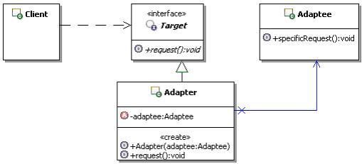

#适配器设计模式

##适配器设计模式简介

* 定义：将一个类的接口**转换**成客户希望的另一个接口。适配器模式使得原本**由于接口不兼容**而不能在一起工作的那些类可以一起工作。
* 模式的结构和说明

  	

	* Client：客户端，调用自己需要的领域接口Target。
	
	* Target：定义客户端需要的跟特定领域相关的接口。
	
	* Adaptee：已经存在的接口，通常能满足客户端的功能要求，但是接口与客户端要求的特定领域接口不一致，需要被适配。

	* Adapter：适配器，把Adaptee适配成为Client需要的Target。

* [**适配器设计模式实现**]()

已有的接口：(这里的接口只是客户端和系统进行交互的一个通道，并不一定值值interface)


```java
/**
 * 已经存在的接口，这个接口需要被适配
 */
public class Adaptee {
	/**
	 * 示意方法，原本已经存在，已经实现的方法
	 */
	public void specificRequest() {
		//具体的功能处理
	}
}
```

客户端需要的接口的形式

```java
/**
 * 定义客户端使用的接口，与特定领域相关
 */
public interface Target {
	/**
	 * 示意方法，客户端请求处理的方法
	 */
	public void request();
}

```

适配器对象

```
/**
 * 适配器
 */
public class Adapter implements Target {
	/**
	 * 持有需要被适配的接口对象
	 */
	private Adaptee adaptee;
	/**
	 * 构造方法，传入需要被适配的对象
	 * @param adaptee 需要被适配的对象
	 */
	public Adapter(Adaptee adaptee) {
		this.adaptee = adaptee;
	}

	public void request() {
		//可能转调已经实现了的方法，进行适配
		adaptee.specificRequest();
	}
}

```

思路分析：

1. 适配器Adapter要实现目标Target接口
2. 适配器Adapter要持有被适配的接口对象Adaptee
3. 被适配的对象通过构造方法传入
4. 实现方法的适配，转调已有的方法。


客户端：

```java
/**
 * 使用适配器的客户端
 */
public class Client {	
	public static void main(String[] args) {
		//创建需被适配的对象
		Adaptee adaptee = new Adaptee();
		//创建客户端需要调用的接口对象
		Target target = new Adapter(adaptee);
		//请求处理
		target.request();
	}
}
```	

1. 创建被适配的对象
2. 创建适配器
3. 请求处理（面向Target接口编程，通过适配器对象获得接口）

##适配器模式实例