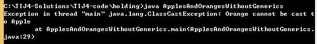
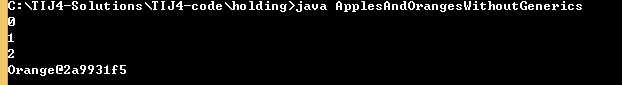
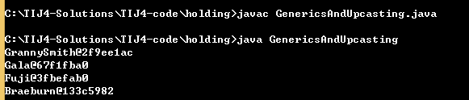

#泛型和类型安全的容器

使用JavaSE5之前的容器一个主要问题就是编译器允许你向容器中插入不正确的类型。

```java
//: holding/ApplesAndOrangesWithoutGenerics.java
// Simple container example (produces compiler warnings).
// {ThrowsException}
import java.util.*;
//Apple类
class Apple {
  //成员变量
  private static long counter;
  private final long id = counter++;
  //成员方法
  public long id() { return id; }
}

//Orange类
class Orange {}	

public class ApplesAndOrangesWithoutGenerics {
  //正常情况下，Java编译器会报告警告信息。因为这个示例没有使用泛型
  //用注解来抑制警告信息。注意以@开头，可以接收参数。
  //@SuppressWarnings("unchecked")只有有关不受“检查的异常”的警告信息应该被抑制。
  @SuppressWarnings("unchecked")
  public static void main(String[] args) {
    ArrayList apples = new ArrayList();
    for(int i = 0; i < 3; i++)
      apples.add(new Apple());
    // Not prevented from adding an Orange to apples:
    apples.add(new Orange());
    for(int i = 0; i < apples.size(); i++)
      ((Apple)apples.get(i)).id();
      // Orange is detected only at run time
  }
} 


```




Orange只会在运行时被检测到错误


这是没有添加注解的编译警告

Apple和Orange类是有区别的，它们之间除了都是Object之外没有任何共性（注意，如果一个类没有显式地声明继承自哪个类，那么它自动地继承自Object）。

因为ArrayList保存的是Object对象，而且无论在编译期还是运行时都不会有问题。当你在使用ArrayList的get()方法来取出你认为是Apple的对象时，你得到的只是Object的引用，必须将其转型为Apple,因为需要将整个表达式括起来，在调用Apple的id()方法之前，强制执行转型。否则你将会得到一个语法错误。在运行时，当你试图将Orange对象转型为Apple时，你就会以前面提及的异常的形式得到一个错误。


```java
//: holding/ApplesAndOrangesWithoutGenerics.java
// Simple container example (produces compiler warnings).
// {ThrowsException}
import java.util.*;
//Apple类
class Apple {
  //成员变量
  private static long counter;
  private final long id = counter++;
  //成员方法
  public long id() { return id; }
}

//Orange类
class Orange {}	

public class ApplesAndOrangesWithoutGenerics {
  //正常情况下，Java编译器会报告警告信息。因为这个示例没有使用泛型
  //用注解来抑制警告信息。注意以@开头，可以接收参数。
  //@SuppressWarnings("unchecked")只有有关不受“检查的异常”的警告信息应该被抑制。
  @SuppressWarnings("unchecked")
  public static void main(String[] args) {
    ArrayList apples = new ArrayList();
    for(int i = 0; i < 3; i++)
      apples.add(new Apple());
    // Not prevented from adding an Orange to apples://不会防止将一个Orange添加到Apple
    apples.add(new Orange());
    for(int i = 0; i < apples.size()-1; i++)
      System.out.println(((Apple)apples.get(i)).id());
      // Orange is detected only at run time
      System.out.println(((Orange)apples.get(3)).toString());
  }
} 


```


使用泛型

要向定义用来保存Apple对象的ArrayList，你可以声明ArrayList<Apple>，尖括号扩起来的是类型参数（可以有多个）。它指定了这个容器实例可以保存的类型。**通过使用泛型，就可以在编译期防止将 错误类型的对象放置到容器中。**

```java
//: holding/ApplesAndOrangesWithGenerics.java
import java.util.*;

public class ApplesAndOrangesWithGenerics {
  public static void main(String[] args) {
    ArrayList<Apple> apples = new ArrayList<Apple>();
    for(int i = 0; i < 3; i++)
      apples.add(new Apple());
    // Compile-time error:编译错误
    // apples.add(new Orange());
    for(int i = 0; i < apples.size(); i++)
      System.out.println(apples.get(i).id());
    // Using foreach:
    for(Apple c : apples)
      System.out.println(c.id());
  }
} /* Output:
0
1
2
0
1
2
*///:~

```
使用了泛型之后，编译器可以阻止你将Orange放置apples中，因此它变成了一个编译期错误，而不再是运行时错误。


向上转型

当指定了某个类型作为泛型参数时，除了可以使用将该确切类型的对象放置到容器中。向上转型也可以想作用于其他类型一样作用于泛型：


```java
//: holding/GenericsAndUpcasting.java
import java.util.*;

class GrannySmith extends Apple {}
class Gala extends Apple {}
class Fuji extends Apple {}
class Braeburn extends Apple {}

public class GenericsAndUpcasting {
  public static void main(String[] args) {
    ArrayList<Apple> apples = new ArrayList<Apple>();
    apples.add(new GrannySmith());
    apples.add(new Gala());
    apples.add(new Fuji());
    apples.add(new Braeburn());
    //foreach语句 
    for(Apple c : apples)
      System.out.println(c);
  }
} 


```


程序的输出是从Object默认的toString()方法产生的，该方法打印类型+该对象的散列码的无符号十六进制表示（散列码通过hashCode（）方法产生的）

