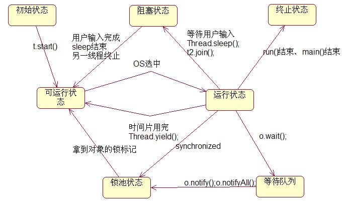

#并发

顺序编程：程序中的所有事物在任意时刻只能执行一个步骤。

* [**并发的多面性**](并发的多面性.md)
* [**基本的线程机制**](基本的线程机制.md)
* [**共享受限资源**](共享受限的资源.md)
* [**终结任务**](终结任务.md)
* [**线程之间的协作**](线程之间的协作.md)
* [**死锁**](死锁.md)
* [**新类库中的构件**](新类库中的构件.md)
* [**仿真**](仿真.md)
* [**性能调优**](性能调优.md)

**线程是进程中一个任务控制流序列**，进程的创建和销毁需要销毁大量的资源，而多个线程之间可以共享进程数据，因此多线程是并发编程的基础。

多核心CPU可以真正实现多个任务并行执行，**单核心CPU程序其实不是真正的并行运行，而是通过时间片切换来执行，由于时间片切换频繁，使用者感 觉程序是在并行运行。**单核心CPU中通过时间片切换执行多线程任务时，虽然需要保存线程上下文，增加了上下文切换的开销，但是**由于不会被阻塞的线程所阻塞**，因此相比单任务还是大大提高了程序运行效率。、

##线程的状态和切换

线程的7种状态及其切换图如下：

