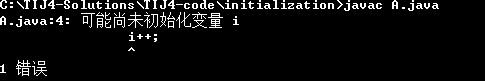

#成员初始化

Java尽力保证：所有变量在使用前都能得到恰当的初始化。

* 方法的局部变量：Java以编译时错误的形式来贯彻这种保证。
	
	```java
		void f() {
			int i;
			i++;//Error--i not initialized
		}
	```
	如果在方法的局部变量中，没有初始化。编译器就会得到一条错误的消息，i可能尚未初始化。

```java
class A{
	public void test() {
		int i;
		i++;
	}

	public static void main(String[] args) {
		A  a =  new A();
		a.test();
	}

}

```


* 类的数据成员是基本类型

	类的每个基本类型数据成员保证都会有一个初始值。

```java
//: initialization/InitialValues.java
// Shows default initial values.
import static net.mindview.util.Print.*;

public class InitialValues {
  boolean t;
  char c;
  byte b;
  short s;
  int i;
  long l;
  float f;
  double d;
  InitialValues reference;
  void printInitialValues() {
    print("Data type      Initial value");
    print("boolean        " + t);
    print("char           [" + c + "]");
    print("byte           " + b);
    print("short          " + s);
    print("int            " + i);
    print("long           " + l);
    print("float          " + f);
    print("double         " + d);
    print("reference      " + reference);
  }
  public static void main(String[] args) {
    InitialValues iv = new InitialValues();
    iv.printInitialValues();
    /* You could also say:
    new InitialValues().printInitialValues();
    */
  }
} /* Output:
Data type      Initial value
boolean        false
char           [ ]
byte           0
short          0
int            0
long           0
float          0.0
double         0.0
reference      null
*///:~


```
尽管数据成员的初值没有给出，但是它们确实有初值（char为0，所以显示为空白）。

在类里定义一个对象引用时，如果不将其初始化，此引用就会获得一个特殊值null。

```
class Test{
	static char a;

	public static void main(String[] args) {
		System.out.println((int)a);
	}

}
```


##指定初始化
Java中，可以在定义类成员变量的地方为其赋值。（注意C++里不能这样做）