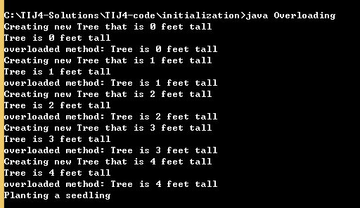
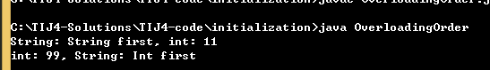

#方法重载

```java
//: initialization/Overloading.java
// Demonstration of both constructor
// and ordinary method overloading.

class Tree {
  int height;
  
  //构造器的重载
  //无参构造器
  Tree() {
    System.out.println("Planting a seedling");
    height = 0;
  }
  //有参构造器
  Tree(int initialHeight) {
    height = initialHeight;
    System.out.println("Creating new Tree that is " +
      height + " feet tall");
  }	
  //方法的重载
  void info() {
    System.out.println("Tree is " + height + " feet tall");
  }
  void info(String s) {
    System.out.println(s + ": Tree is " + height + " feet tall");
  }
}

public class Overloading {
  public static void main(String[] args) {
    for(int i = 0; i < 5; i++) {
      Tree t = new Tree(i);
      t.info();
      t.info("overloaded method");
    }
    // Overloaded constructor:
    new Tree();
  }	
}

```

##区分重载方法

每个重载的方法都必须有一个独一无二的参数类型列表。（参数顺序的不同也可以区分两个方法，但是这么做会使代码难以维护）

```
//: initialization/OverloadingOrder.java
// Overloading based on the order of the arguments.

public class OverloadingOrder {
  
  //相同的参数，但是顺序不同
  static void f(String s, int i) {
    System.out.println("String: " + s + ", int: " + i);
  }
  static void f(int i, String s) {
    System.out.println("int: " + i + ", String: " + s);
  }
  public static void main(String[] args) {
    f("String first", 11);
    f(99, "Int first");
  }
} 
```




##涉及基本类型的重载

基本类型能够从一个“较小”的类型自动提升至一个“较大”的类型，此过程一旦牵涉到重载，可能会造成一些混淆。


不能以返回值区分重载方法